The network diagram for the distributed ingress vpc looks like this:

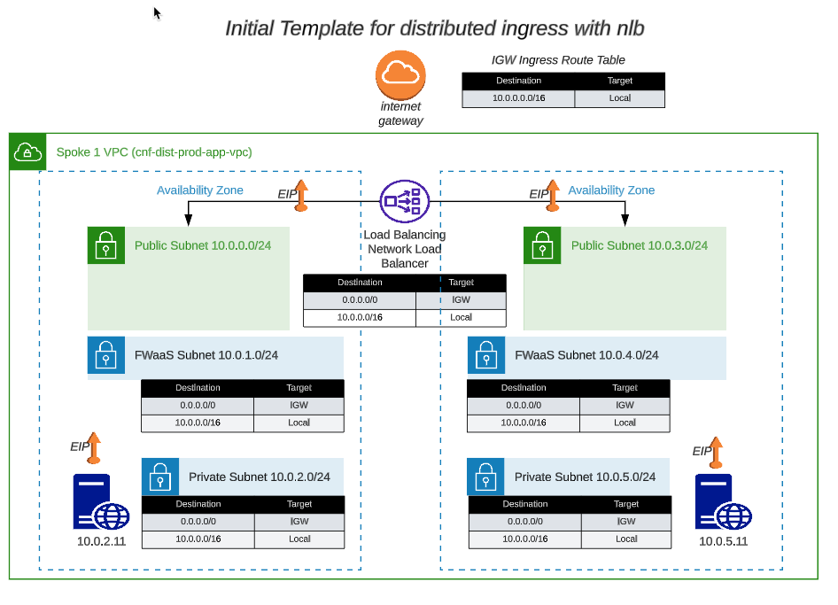

* Let's take a look at the security group for the linux instance. 
  * From Console Home, click on EC2
  * From EC2, click on Instances (running)
  * Choose the instance in AZ1
  * Click on the security tab for the instance
  * Click on the link to the security group

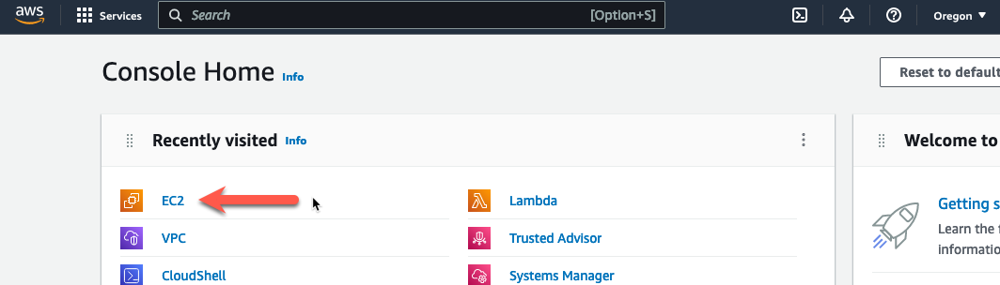
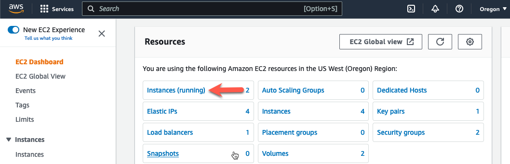
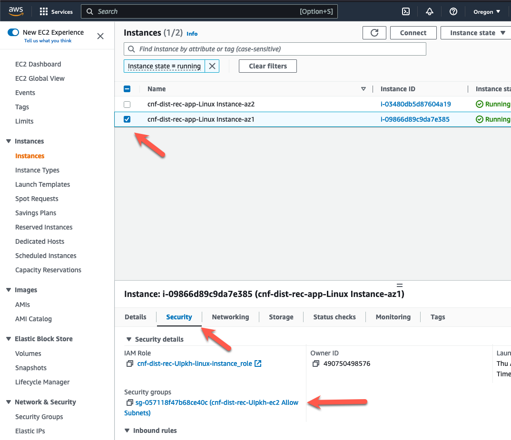

* On this screen, we can see that we are allowing SSH (tcp port 22) and HTTP (tcp port 80) from any IPv4 address. The instance is protected from login by the ssh keypair, but let's tighten the security up using the security group to prevent random access to the Apache server. 
  * Click on "Edit Inbound Rules" (yellow arrow)

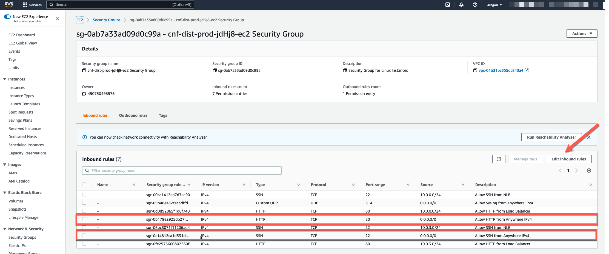

* Click on the "Source" dropdown and change "Anywhere-IPv4" to "My IP" for the Inbound HTTP and Inbound SSH.
* Change the description from Anywhere to My IP
* Click "Save Rules"

 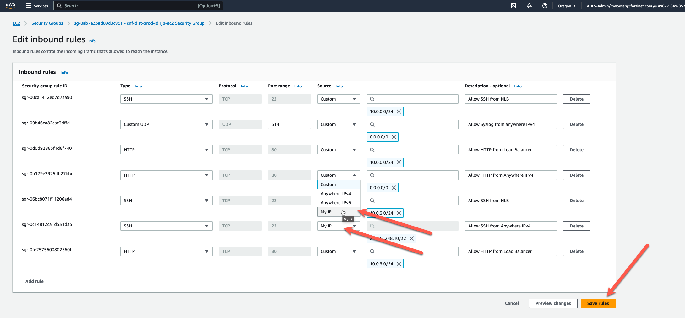

* Now we have security rules to access our linux instances via SSH and HTTP from our Public IP. 

 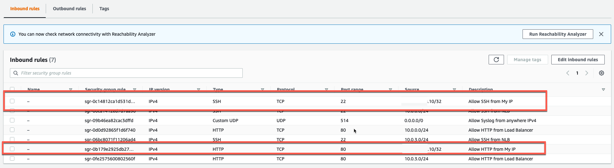

* We also have security rules that allow HTTP and SSH via the NLB to have access to the linux instances. The NLB has a Public IP in each AZ. This allows us to access the backend servers through the NLB and the access will be load balanced across each AZ. 

 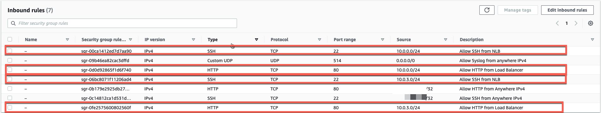

* We also allowed the CNF instance to use the instance as a Syslog Server. In this workshop, both instances use the same security group, so there is no need to make the same changes to the security group on the second instance. 

 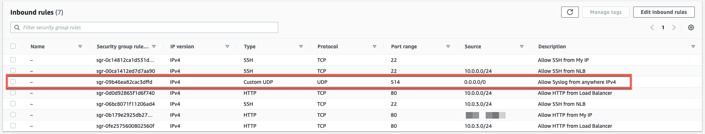

* Lookup the "Public IP" associated with each linux instance and bring up a browser to verify connectivity. You should see a slightly modified Default Apache2 Page that also shows the AZ of the response linux instance.

 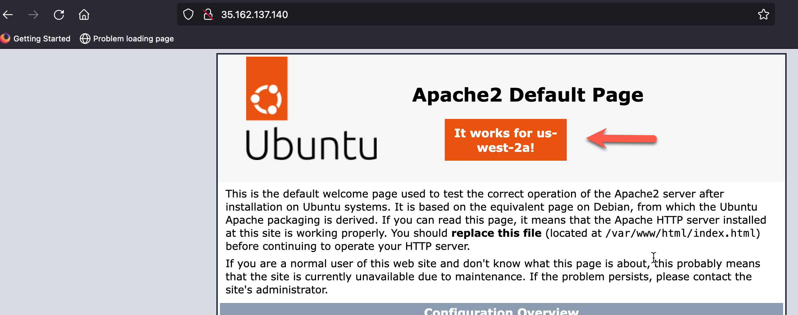
 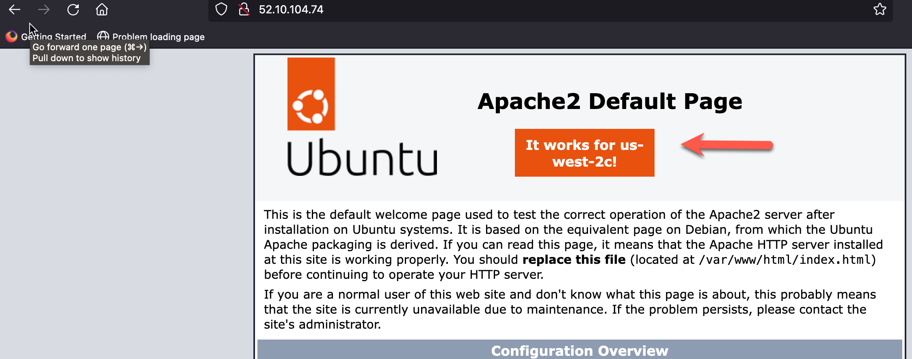

* This was a small demonstration on managing security policy with security groups. A bit tedious don't you think? Now let's deploy a Fortigate CNF instance and manage security policy with a Next Generation Firewall. 

* This concludes this section.
