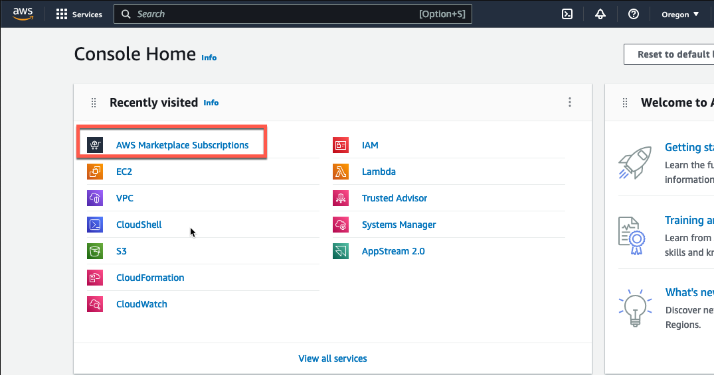
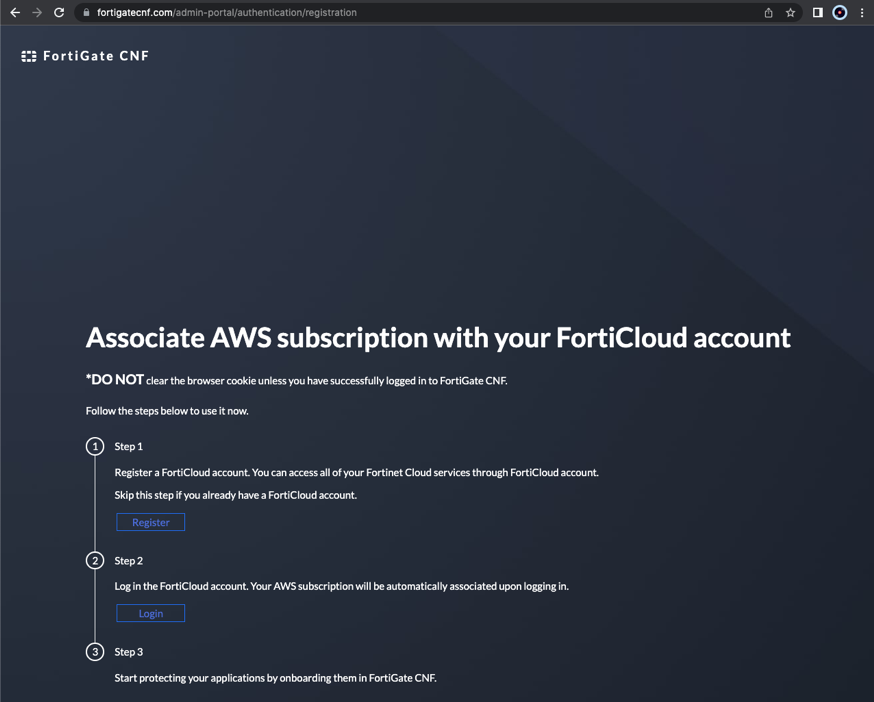

* Log into your AWS account and navigate to the AWS Marketplace listing for [**FortiGate CNF**](https://aws.amazon.com/marketplace/pp/prodview-vtjjha5neo52i). In the upper right corner, click **View purchase options**. On the next page, click **Subscribe**.

* In the available offers list, **select the Public offer**.

* The page should update and show the GA pricing.  Click **Subscribe**.

* A green banner will be at the top of the screen. Click **Set up your account** and this will redirect you to associating this subscription to your FortiCloud account.

* If you do not already have a FortiCloud account*, the [**Register**](https://support.fortinet.com/cred/#/sign-up) button will navigate you to where you can create your own account quickly. **Otherwise move on to the next step and login to your existing FortiCloud Account**.

* You should see this page showing your information and that the subscription has been successfully applied to your FortiCloud account.

* Click on your account tile and you will now be on the dashboard of FortiGate CNF.

* This concludes this section.
