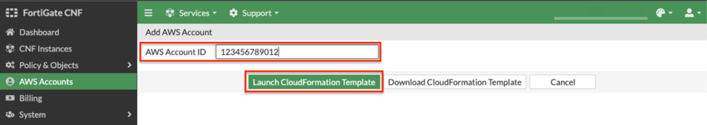

* In the FortiGate CNF Console, navigate to AWS Accounts, then click **New** to start the add account wizard.

* In a new browser tab, log into your AWS account and click on your **IAM user name in the upper right corner**. This will allow you to see and copy your AWS account ID.

* In the FortiGate CNF Console, provide your AWS account ID and select Launch CloudFormation Template. This will redirect you to the CloudFormation Console in your AWS account in the us-west-2 region.

{}
**Note:** Your browser may block the popup window to launch the CloudFormation console.  Please check your browser for blocked popup notifications.
{}

* This CloudFormation Template creates the following items:

	* S3 bucket for sending logs

	* IAM Cross Account Role which allows us to manage GWLBe endpoints, describe VPCs, push logs to S3, and describe instances and EKS clusters for the SDN connector feature (dynamic address objects based on metadata).

	* Custom resources which kicks off automation on our managed accounts to complete backend tasks for onboarding the AWS account.

* Please follow through the create stack wizard **without changing the region or any of the parameter values**. Simply follow the steps outlined in the FortiGate CNF Console and click through the CloudFormation wizard.

{}
**Note:** This CloudFormation template must be ran in the us-west-2 (Oregon) region for successful onboarding and ongoing operations of this AWS account with FortiGate CNF.
{}

* Once the CloudFormation template has been created successfully, you should see your account showing **Success** in the AWS account page of FortiGate CNF.

* This concludes this section.
