* In the FortiGate CNF console, navigate to CNF instances and click **New**.

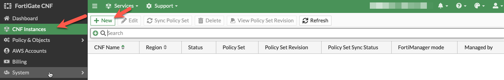

* Provide a name for the CNF instance, select **us-west-2** for the region for deployment, select **External Syslog** for the log type, and insert the  **Linux AZ1 Public IP** you wrote down earlier when you created the Workload VPC. Then click **OK** at the bottom. This will drop you back to the list of CNF instances while this is deployed in the background.

{}
**Note:** FortiGate CNF is available in the following regions today.  Based on customer demand, more regions will be supported in the future.
{}

  * us-east-1 (N. Virginia)
  * us-east-2 (Ohio)
  * us-west-1 (N. California)
  * us-west-2 (Oregon)
  * eu-central-1 (Frankfurt)
  * eu-west-1 (Ireland)
  * ap-northeast-1 (Tokyo)

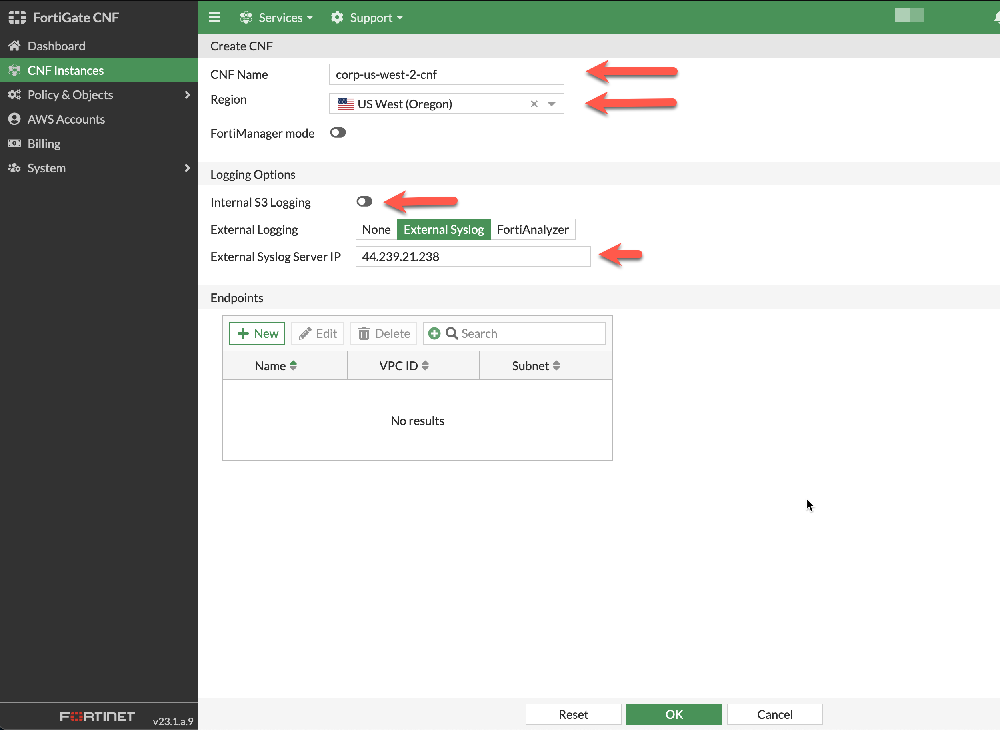

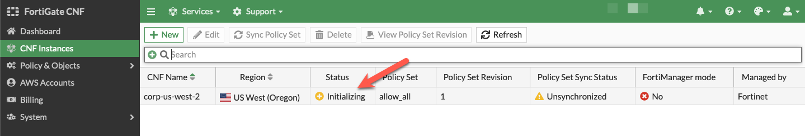

* The CNF Instance should show up as **active after roughly 10 minutes** (Now is a great time for a break :) ). Then you can **select and edit** it to deploy endpoints and assign a policy set.

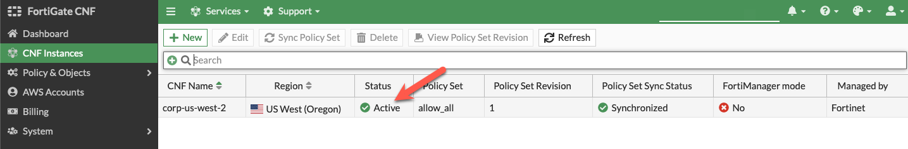

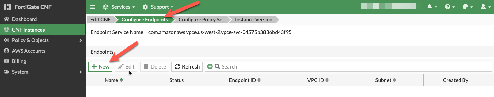

* On the Configure Endpoints section of the wizard, click the **New** button. Then you can select the account, VPC, then toggle the **Select from all subnets to off** (this filters the subnets to only show ones that are properly tagged), and the subnet to deploy the VPC endpoint to. Repeat this step for all subnets in the table below, then click the **Next** button.  Once all have been created, click **Next*.

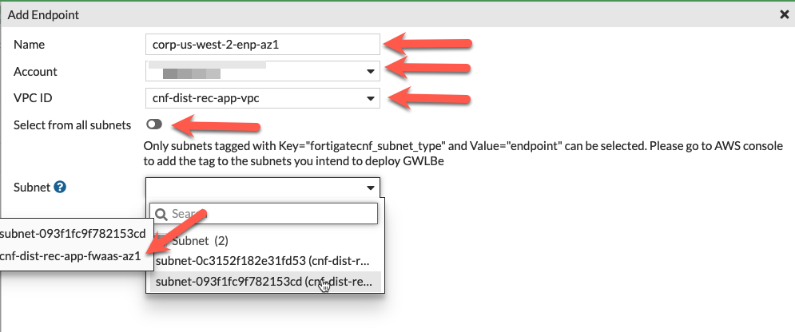
VPC | Subnet
---|---
Workload-VPC | cnf-dist-rec-app-fwaas-az1
Workload-VPC | cnf-dist-rec-app-fwaas-az2

{}
**Note:** In order for FortiGate CNF to successfully create a GWLBe in a subnet, **the subnet must be properly tagged**.  The subnet needs a Tag ***Name = fortigatecnf_subnet_type*** and Tag ***Value = endpoint***. Otherwise you will see an error that the subnet ID is invalid.  The subnets below have already been tagged properly. **In this example environment, the subnets above have already been properly tagged.**
{}

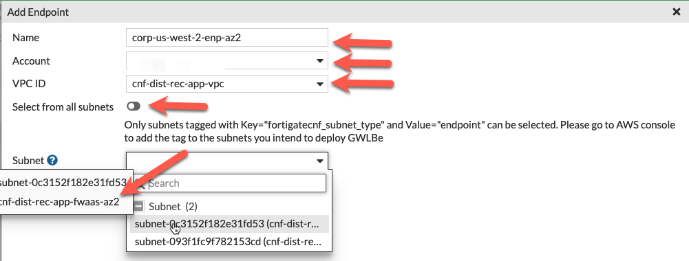

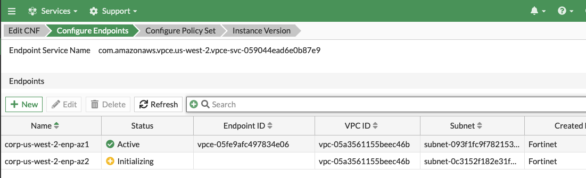

* After approximately 5 minutes, both endpoints should show "Status" active.

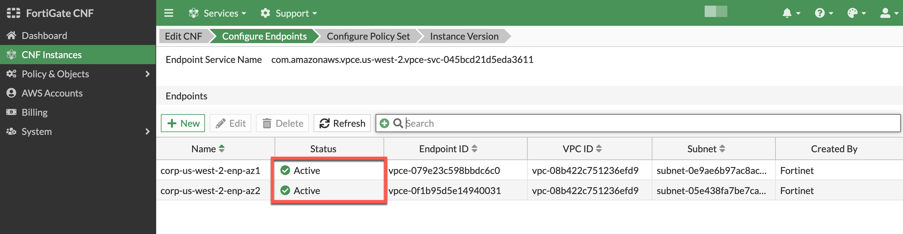

* On the Configure Policy Set section of the wizard, use the default 'allow_all' policy to allow all traffic from a Layer 4 perspective and click **Finalize** to push that default policy. In some versions of Fortigate CNF, the default "allow all" policy is automatically pushed and this step is unnecessary. In this case, click "Exit" to continue. You should then see the list of CNF instances again.

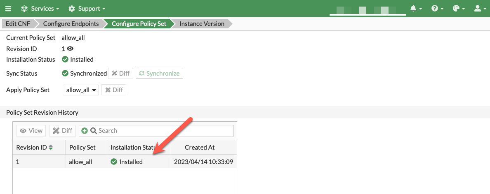

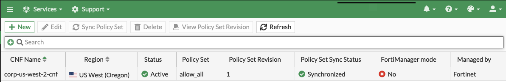

* To validate all GWLBe endpoints have been deployed and are active (takes ~5 mins), **select and edit** the CNF instance and click **Next** to view the GWLBe endpoints on the Configure Endpoints section of the wizard. Then click **Exit** to leave the CNF configuration wizard.

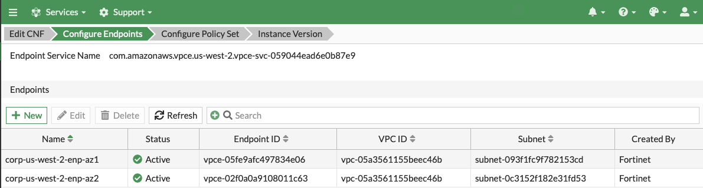

* Log into your AWS Account and navigate to the **VPC Console > Endpoints**.  Each of the GWLBe endpoints you deployed in the FortiGate CNF Console should be visible in your account.  Notice the tag name and value pairs assigned to the endpoints.

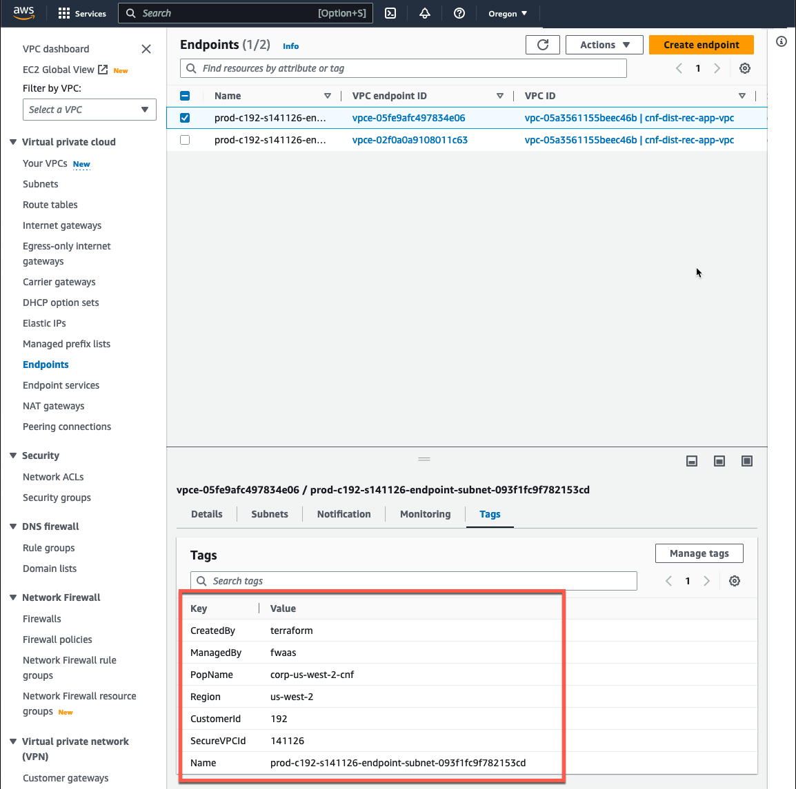

{} The next task will be to modify the VPC route tables to direct traffic into the endpoints for inspection by Fortigate CNF
{}

* This concludes this section.
