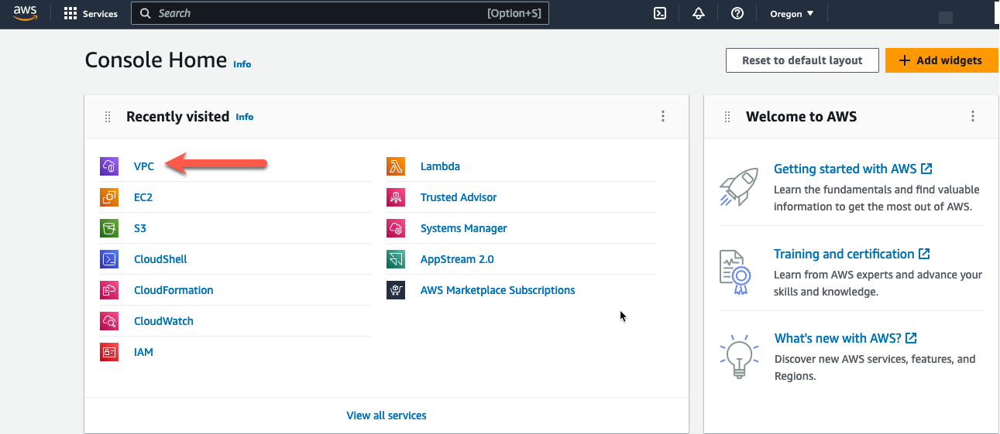

* The initial deployed terraform template is a working deployment with ingress traffic NAT'd to all of the EIP's by the IGW. Egress traffic is sent to the IGW by a default route in each route table pointing to the IGW. The initial deployment will not have any security, except for the security groups. This initial template design is depicted in this picture:

* The default VPC route tables route the traffic directed at one of the EIP's into the VPC as local traffic. In other words, if the traffic is directed at an Elastic IP on the NLB or one associated with a Linux instance, the IGW will NAT the traffic to the private IP associated with the EIP public IP. For egress traffic, all VPC route tables have a default route that points to the IGW.

* Once we deploy a FortiGate CNF instance and the associated endpoints, we will need to modify the Spoke VPC route tables for the CNF instances to inspect the traffic. To redirect the ingress traffic, we need a few route table entries added to the IGW Ingress Route Table. To redirect egress traffic, change the default route in the private route table. The modified design will look like this:

{}
**Note:** Changes to the route tables are in RED.
{}

{}
**Note:** If you don't have Elastic IP's associated with each Linux Instance, then the last two entries in the IGW Route Table are unnecessary.
{}

* The tricky part here is to make sure you point the routes at the correct CNF Endpoint, i.e. the endpoint in the same AZ as the route table that you are modifying. If you don't do this correctly, you will create routes that push the traffic across AZ's and add cost to the deployment. Watch for the **hints** below to assist with this.

* Log into your AWS account and navigate to the [**Console Home**](https://us-west-2.console.aws.amazon.com/console/home?region=us-west-2#).
* Click on the VPC icon

* First, we need to understand which CNF Endpoint is deployed in each AZ. To do this, click on "Endpoints" in the left pane.

* Then choose one of the CNF Endpoints and click subnets in the lower window.

* From this screen, you can see the subnet id where the Endpoint is deployed. You have a few options here. 
  * You could navigate to the subnet tab on the left navigation pane and check which AZ that subnet is in using the subnet id. 
  * You might notice that the IP address is 10.0.4.75. If you check the network diagram above, you can see that the 10.0.4.0/24 CIDR is in AZ2. 
  * In this case, I included the AZ in the name of the name of the subnet "cnf-dist0-prod-app-az2" in the terraform that deployed the workshop VPC. It's a useful hint in this case, but that may not be true in other VPC environments. 
  * Nevertheless, this endpoint (vpce-xxxxc79b) is deployed in AZ2 and (vpce-xxxxc150) is deployed in AZ1. 
  * You might want to add this info to your scratchpad.

* Now let's modify the route tables. Click on "Route tables" in the left pane

* Highlight the IGW Ingress Route table named "cnf-dist-rec-igw-rt". 
* Click on the "Routes" tab at the bottom. 
* Click on "Edit routes".

* We could just change the full VPC CIDR Route and send the traffic to one of the GWLB Endpoints we created earlier. That would redirect all ingress traffic to one AZ or the other. But that would create cross AZ traffic and that would drive up the cost of the deployment. Don't do this!

* Instead, let's create an entry for each VPC subnet that we want to redirect and send it to the GWLBe in the same AZ. In this example, we have an NLB with a subnet mapping in the Public Subnet in each AZ. We can see this by looking at the Network Mapping associated with the NLB. 

* So lets add an IGW Ingress Route Table entry for each Public Subnet CIDR and send that traffic to the GWLBe in the same AZ. 
  * Remember, 10.0.0.0/24 is in AZ1 and the VPC Endpoint for AZ1 is vpce-xxxxc79b
  * 10.0.3.0/24 is in AZ2 and the VPC Endpoint for AZ2 is vpce-xxxxc150

* If we want the firewall to inspect traffic going to the EIP associated with the Linux instances, we need to add a similar route entry. The Linux instances are in the private subnet. Those CIDR's are 10.0.2.0/24 and 10.0.5.0/24. So add route table entries for those CIDR's.
* Click "Save changes"
* These changes redirect ingress traffic. Now lets redirect egress traffic.

{}
**Note:** Disregard the actual VPC Endpoint ID's used in the images. The workshop images were collected over multiple deployments and the VPCE ID's may have changed. We just want to make sure AZ Affinity is preserved when adding the routes.
{}

* In this example, all the traffic goes to the linux instances and those instances are in the private subnets. The ingress traffic can be directed at the NLB subnet mappings or directly to the EIPs on the Linux instances. To have the egress traffic inspected, we need to redirect the traffic leaving the private subnet into the GWLBe. 
* Navigate back to the "Route tables" screen.

* Currently, the private route tables are sending all traffic to the IGW. This will not allow Fortigate CNF to inspect egress traffic. In the private subnet table, add a default route to send all traffic leaving the private subnet to the GWLBe in the same AZ. 
* Highlight the private route table for AZ1.
* Click the "Routes" tab at the bottom
* Click "Edit routes"

* Change the default route target to the GWLBe in AZ1.
* Click "Save changes"

* Navigate back to the "Route tables" screen and change the default route for the private subnet in AZ2. 

* Highlight the route table for the private subnet in AZ2.
* Click "Routes" tab at the bottom
* Click "Edit routes"

* Change the default route target to the GWLBe in AZ2.
* Click "Save changes"

* Ingress and Egress traffic is now being sent to Fortigate CNF for inspection.

* The next task will create a "Policy Set" for Fortigate CNF and this will allow us to create a security policy and log the traffic.

* This concludes this section.
