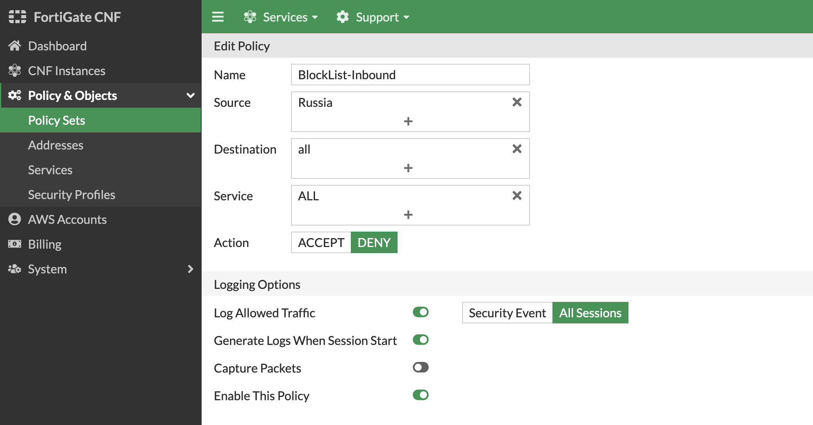

* At this point, we are using the default **allow_all** policy set which allows all communication to be allowed without any restriction from a Layer 4 and Layer 7 perspective.

* To customize the actual L4 rules and L7 security profile groups applied, in the FortiGate CNF Console **navigate to Policy & Objects > Policy Sets** to create your own policy set.  Simply **click Create New**, select **Policy Set**, and give your policy set a name.

* Before adding in L4 rules within the policy set, create a few simple address objects.  **Navigate to Policy & Objects > Addresses**, click New, and Address. Then create each of the address objects below.

Name | Type | IP/Netmask Value
---|---|---
ClassA | Subnet | 10.0.0.0/8
ClassB | Subnet | 172.16.0.0/12
ClassC | Subnet | 192.168.0.0/16
GooglePublicDNS1 | Subnet | 8.8.8.8/32
GooglePublicDNS2 | Subnet | 8.8.4.4/32
PrivateAZ1 | Subnet | 10.0.2.0/24
PrivateAZ2 | Subnet | 10.0.5.0/24

* Next, create an Address Group to include all the RFC 1918 class objects. On the same page, **click New, and Address Group**. Then create each the address object below.

Name | Members Value
---|---
RFC-1918 | ClassA, ClassB, ClassC

* In FortiGate CNF you can create different types of address objects to be more flexible and granular in your rules within your policy set. Create an FQDN based address object by **clicking New, and Address**. Select FQDN for Type, then create the address object below. 
* Create an address object by **clicking New, and Address**. Select *IP Range* for Type, then create the address object below using the output of "What's My IP". When can use this Address Object to filter out the probe's that commonly come from the internet.

{}
**Note:** This can be used for internal Application, Network, and even legacy Elastic Load Balancers (ie ALB, NLB, ELB) to dynamically resolve their private IPs.
{}

Name | Type | FQDN Value
---|---|---
ipinfo.io | FQDN | ipinfo.io
my-ip | IP Range | <whats my ip> - <whats my ip>

* Geography based address objects are available in FortiGate CNF. This allows controlling traffic based on public IPs assigned to countries around the globe. These objects can be used as a source or destination object within policies used in a policy set. Create a geo based address object by **clicking New, and Address**. Select Geography for Type, then create the address objects below.

{}
**Note:** The IP for the country or region is automatically determined from the Geography IP database which is provided by FortiGuard Servers on a recurring basis.  For more granular control to applications (especially external), it is recommended to use URL or DNS filtering and even Application Control for L7 inspection.
{}

Name | Type | Country/Region Value
---|---|---
UnitedStates | Geography | United States
Russia | Geography | Russian Federation

* Dynamic metadata based address objects are available in FortiGate CNF. This allows controlling of traffic based on things such as VPC ID, Auto Scale Group, EKS Cluster or Pod, and even Tag Name + Value pairs for a given AWS account and region. Create a dynamic based address object by **clicking New, and Address**. Select Dynamic for Type, then create the address objects below.

{}
**Note:** This is using AWS API calls behind the scenes such as ec2:DescribeInstances, eks:ListClusters, eks:DescribeCluster, etc. For instances, these must be running to have their IP address(es) (public and or private IPs) returned.
{}

**Note:** For each object, you will use the same values for these settings:

Type | AWS Account ID | AWS Region
---|---|---
Dynamic | Workshop-AWS-Account-ID | us-west-2

Here is the dynamic object to create:

Name | SDN Address Type | Filter Value
---|---|---
ApacheBackend | Private | Tag.Workshop-Function=ApacheServer and Tag.Environment=prod

* Now you will create a policy set to enforce L4 rules using the address objects you just created in the previous steps.  **Navigate to Policy & Objects > Policy Sets** and click New, Policy Set. Give it a name and click Ok. You will be returned to the list of policy sets. **Select your policy set and click Edit**.

* Now you can create the policies listed below to control all directions of traffic within the example environment. **Click New** and create the policies listed below:

Name | Source | Destination | Service        | Action | Log Allowed Traffic
---|---|----------|----------------|---|---
BlockList-Outbound | all | Russia   | ALL            | DENY | All Sessions
BlockList-Inbound | Russia | all      | ALL            | DENY | All Sessions
ipinfo_rule | Class A | ipinfo_fqdn | ALL            | DENY | All Sessions
allow_my_ip | my-ip | RFC-1918 | ALL_ICMP, HTTP | ACCEPT | All Sessions
ApacheBackend-Inbound | UnitedStates | ApacheBackend | SYSLOG, SSH    | ACCEPT | All Sessions
ICMP-Egress | RFC-1918 | UnitedStates | ALL_ICMP       | ACCEPT | All Sessions

* In order to use this policy set, it must be applied to the deployed FortiGate CNF Instance. Navigate to CNF instances and **select and edit** the CNF Instance then **click the Configure Policy Set** bread crumb. In the Apply Policy Set, select your policy set then **click Save then Finalize**.

{}
**Note:** If you skip this step, your CNF Instance would still be using the allow_all policy set which means it basically just a cool FireRouter. :stuck_out_tongue_winking_eye: 
{}

* Since we configured Fortigate CNF to use the Linux instance in AZ1 as an "External Syslog Server" and we allowed SSH into the "ApacheBackend" instances, lets SSH into the Linux Instance in AZ1 and look at the CNF logs.
* Open a terminal and SSH to the Public IP of the Linux instance in AZ1 using the keypair for the linux instance.

* Linux Instance Public IP

* SSH into the instance (standard terminal. If you use windows, you may use putty)

* Use "lnav /var/log/syslog" tool to view the syslog

* Use the arrow keys to navigate in the window (e.g. RIGHT ARROW). Read up on the lnav tool for more information.
* Use "G" key to go to the end of the logs
* 

* Let's exercise a few of the policies and filter the logs using lnav. 
* First, let's get another terminal window and ssh into the linux instance in AZ2. Grab the IP from your scratchpad. 

* Verify the log entry using lnav. 
* Below is the log entry using the Dynamic Address Object "ApacheBackend" that allows SSH into linux instances.

{}
**Note:** If you are having difficulty finding the log entry with lnav, here are a few useful lnav commands:
* "G" to go to the end of the log
* :filter-in srcip=10.0.5.11
* :filter-in service="SSH"
* Ctrl-R to reset your filters

{}

   
 

* While we are here, let's ping ipinfo.io and test the ipinfo_rule in the policy set. 
* FortiGate CNF used the FQDN address object "ipinfo.io" to resolve the IP address and apply the security policy.

 

* Let's try the "BlockList-Outbound" policy and ping an IP address in Russia. Try ping 109.169.203.90.

* Feel free to experiment with Fortigate CNF and watch the log to verify correct policy enforcement. 

* This concludes this section.
