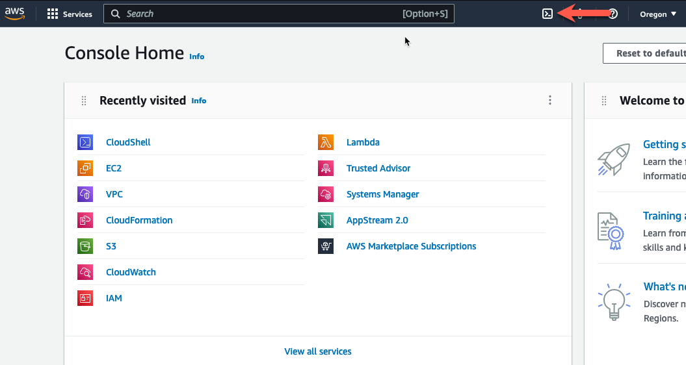

* Log into your AWS account and navigate to the [**Console Home**](https://us-west-2.console.aws.amazon.com/console/home?region=us-west-2#).

{}
**Note:** Make sure you are running this workshop in the intended region. The defaults are configured to run this workshop in us-west-2 (Oregon). Make sure your management console is running in us-west-2 (Oregon), unless you intend to run the workshop in a different FortiGate CNF supported region.
{}


* Click on the AWS CloudShell icon on the console navigation bar



{}
**Note:** You installed terraform into the AWS Cloudshell environment in Task 1. If you destroyed the Cloudshell environment, you will need to install terraform again. See Task 1 for instructions.
{}

{}
**Note:** You may have already cloned this repository in a previous task. If so, you can skip this step.
{}

* Clone a repository that uses terraform to create a distributed ingress workload vpc

  ``` git clone https://github.com/FortinetCloudCSE/FortiGate-AWS-CNF-TEC-Workshop.git ```

* Change directory into the newly created repository for distributed_ingress_nlb

  ``` cd ~/FortiGate-AWS-CNF-TEC-Workshop/terraform/centralized_ingress_egress_east_west/ ```
  
* Copy the terraform.tfvars.example to terraform.tfvars

  ``` cp terraform.tfvars.example terraform.tfvars ```
  


* Edit the terraform.tfvars file and insert the name of a valid keypair in the keypair variable name and save the file

{}
**Note:** Examples of preinstalled editors in the Cloudshell environment include: vi, vim, nano
{}

{}
**Note:** AWS Keypairs are only valid within a specific region. To find the keypairs you have in the region you are executing the lab in, check the list of keypairs here: AWS Console->EC2->Network & Security->keypairs. 
This workshop is pre-configured in the terraform.tfvars to run in the us-west-2 (Oregon) region. 
{}


{}
**Note:** You may change the default region in the terraform.tfvars file to another FortiGate CNF supported region if you don't have a valid keypair in that region and you don't want to create one for this workshop.
{}


* Use the "terraform init" command to initialize the template and download the providers

  ``` terraform init ```


* Use "terraform apply --auto-approve" command to build the vpc. This command takes about 5 minutes to complete.

``` terraform apply --auto-approve ```


* When the command completes, verify "Apply Complete" and valid output statements.
  * Copy the "Outputs" section to a scratchpad. We will use this info throughout this workshop.


The network diagram for the centralized egress vpc looks like this:


* This concludes this section.
