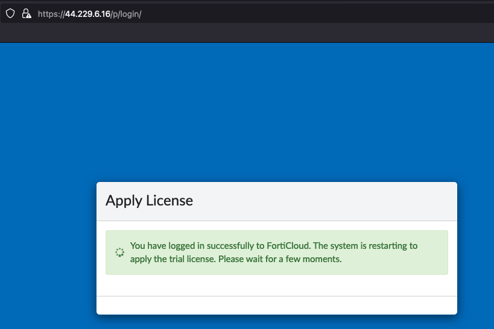
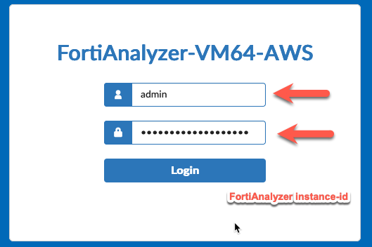
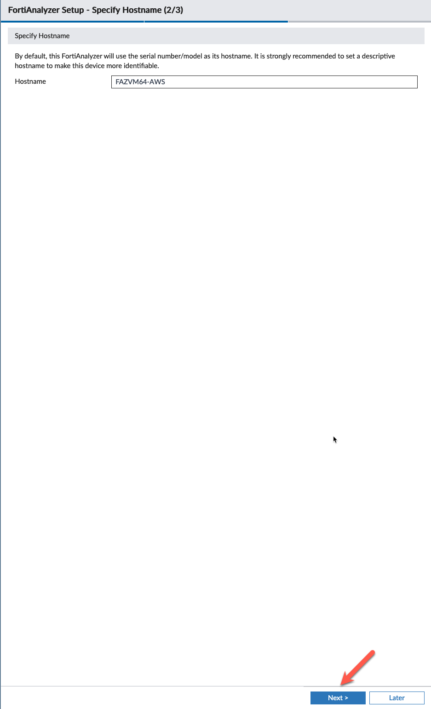

{}
**Note:** Since this is a workshop, we will use the trial license for FortiManager and FortiAnalyzer. You must have know your credentials for your FortiCloud account to get through this task in the workshop. The trial license is valid for 15 days. 
{}

* In the next couple of  tasks, we will initialize FortiManager and FortiAnalyzer. Let's start with the FortiAnalzyer. Find the FortiAnalyzer IP address and instance ID from the output of the Terraform template you saved to your scratchpad. Be sure to accept the self-signed certificate presented by FortiAnalyzer.

* Login to FortiAnalyzer with the credentials you used to create your FortiCloud account. 
* Click **Free Trial** 
* Click **Login with FortiCloud**

* Scroll to the bottom of the "Terms" and click the box that Accepts the terms of the license.
* Click **Accept**

* This will cause the FortiAnalyzer to reboot and apply the license. This will take a minute.

{}
**Note:** If the FortiAnalyzer reboots to screen asking the user to attach an entitlement file, the FortiAnalyzer is unable to contact FortiCloud to verify the trial license. If this happens, rebooting the FortiAnalyzer from the AWS EC2 screen should resolve the problem.
{}

* Once the FortiAnalyzer has rebooted, accept the self-signed certificate and login again with with the default credentials of **admin** and **instance-id** as password.

* Accept the defaults on the Setup screen and click **Begin**

* Accept the default hostname, unless you want to change it.

* Now change the default password (instance-id) to something more secure. This will log you out and force you to login again with the new password.

* Setup complete, click **Finish**

* This concludes this section.
