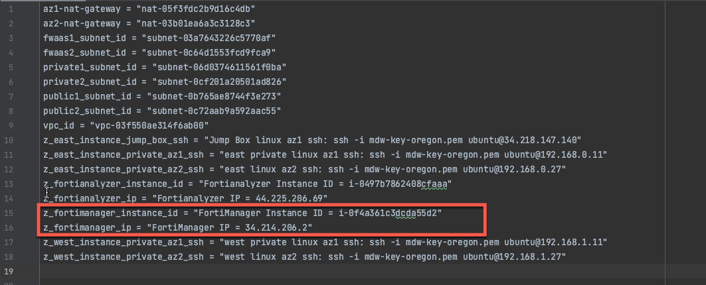
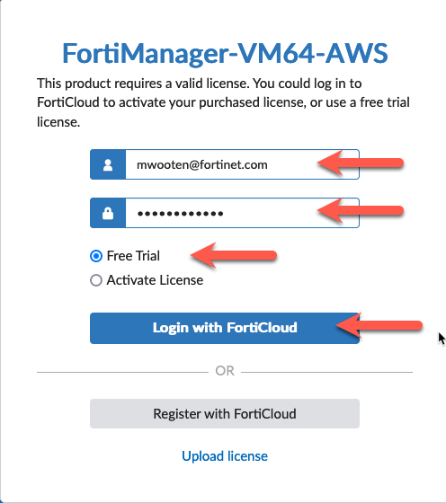

* In this task, we will initialize FortiManager. Find the FortiManager IP address and instance ID from the output of the Terraform template you saved to your scratchpad. Be sure to accept the self-signed certificate presented by FortiManager during initial login.

* Login to FortiManager with the credentials you used to create your FortiCloud account. 
* Click **Free Trial** 
* Click **Login with FortiCloud**

* Scroll to the bottom of the "Terms" and click the box that Accepts the terms of the license.
* Click **Accept**

* This will cause the FortiManager to reboot and apply the license. This will take a minute.

{}
**Note:** If the FortiManager reboots to screen asking the user to attach an entitlement file, the FortiManager is unable to contact FortiCloud to verify the trial license. If this happens, rebooting the FortiManager from the AWS EC2 screen should resolve the problem.
{}

* Once the FortiManager has rebooted, accept the self-signed certificate and login again with the default credentials of **admin** and **instance-id** as password.

* Accept the defaults on the Setup screen and click **Begin**

* Accept the default hostname, unless you want to change it.
* Click **Next**

* Now change the default password (instance-id) to something more secure. This will log you out and force you to login again with the new password.

* This concludes this section.
