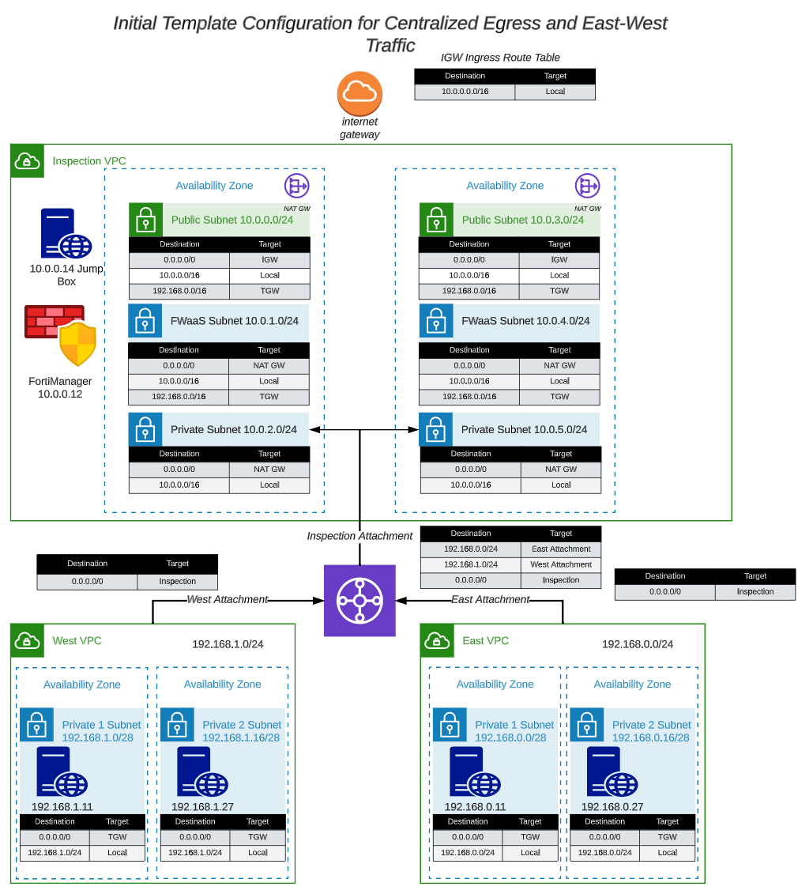
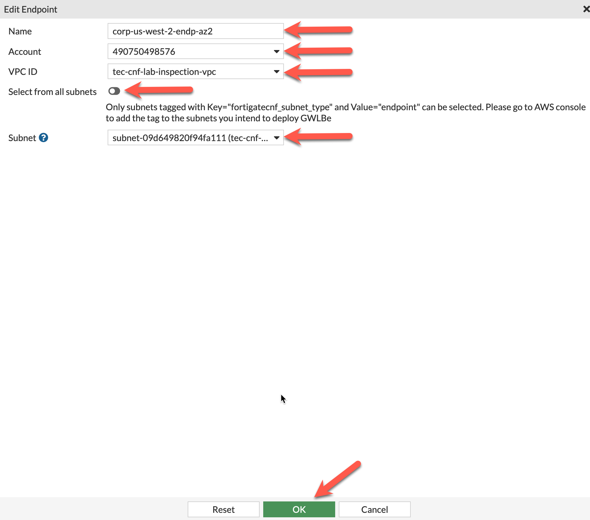
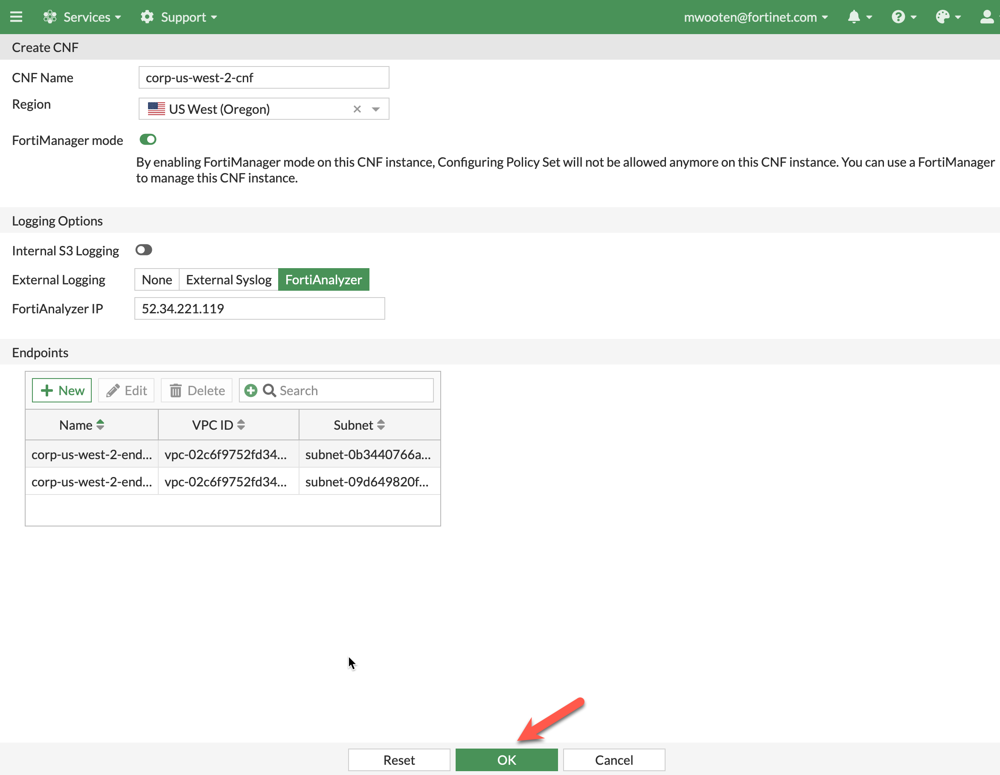
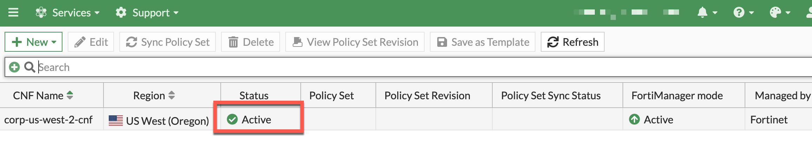
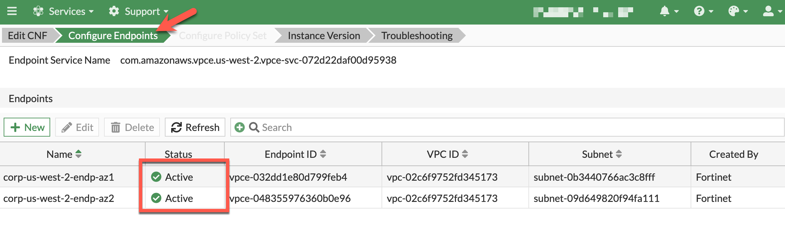
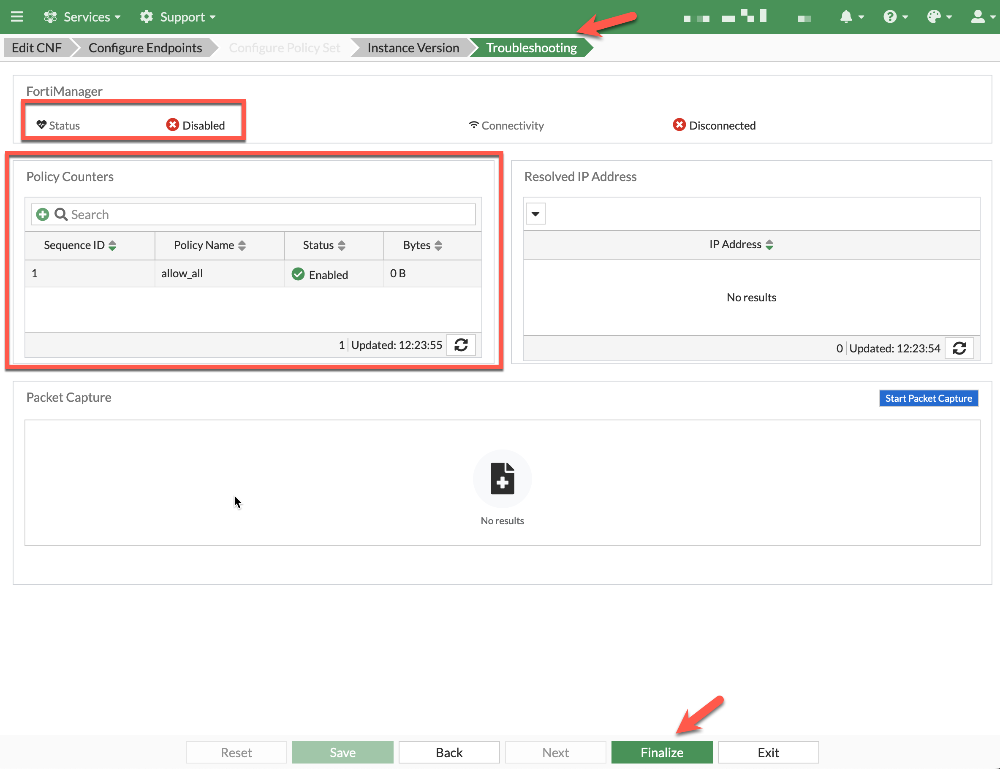

The network diagram for the centralized egress vpc (included here for convenience) looks like this:

* Prerequisite: You must have completed "Task 4: Subscribe to FortiGate CNF in AWS Marketplace" before continuing. This task will only need to be completed once per AWS account.

* Prerequisite: You must have completed ""Task 5: Onboard an AWS account to FortiGate CNF" before continuing. This task will only need to be completed once per AWS account.

* In the FortiGate CNF console, navigate to CNF instances and click **New**.

* Provide a name for the CNF instance. This workshop example uses **corp-us-west-2-cnf**. 
* Select **us-west-2** for the region. 
* Click **FortiManager mode**
* Under **Logging Options**, make sure **Internal S3 Logging** is unchecked
* select **FortiAnalyzer** for the external logging and insert the FortiAnalyzer IP from your scratchpad.
* Under **Endpoints**, click **New** to create a GWLB Endpoint for AZ1

* 

* Provide a Name for the endpoint this workshop uses **corp-us-west-2-endp-az1**
* Use the dropdown to select the account you onboarded in Task 5
* Choose the **tec-cnf-lab-inspection-vpc** from the dropdown for VPC ID
* Uncheck **Select from all subnets** and choose **cnf-dist-rec-app-fwaas-az1** from the dropdown
* Click **OK** to continue

* Under **Endpoints**, click **New** to create a GWLB Endpoint for AZ1

* Provide a Name for the second endpoint. This workshop uses **corp-us-west-2-endp-az2**
* Use the dropdown to select the account you onboarded in Task 5
* Choose the **tec-cnf-lab-inspection-vpc** from the dropdown for VPC ID
* Uncheck **Select from all subnets** and choose **cnf-dist-rec-app-fwaas-az2** from the dropdown
* Click **OK** to continue

* The "Create CNF" screen should look like this
* Click **OK** to continue

* The CNF Instance should show up as **active after roughly 10 minutes** (Now is a great time for a break :) ). Then you can **select and edit** it to deploy endpoints and assign a policy set.

* Approximately 10 minutes later... 

* To validate all GWLBe endpoints have been deployed and are active, **select and edit** the CNF instance and click **Edit**. 

* To view the GWLBe endpoints on the Configure Endpoints section of the wizard. Verify that both endpoints are active and have a status of **Active**.

* Click **Troubleshooting**. Here you can see that FortiManager status is currently disabled. We will connect the FortiManager in a later task. You can also see that **allow_all** policy is currently active.
* Click **Finalize** to continue

* This concludes this section.
