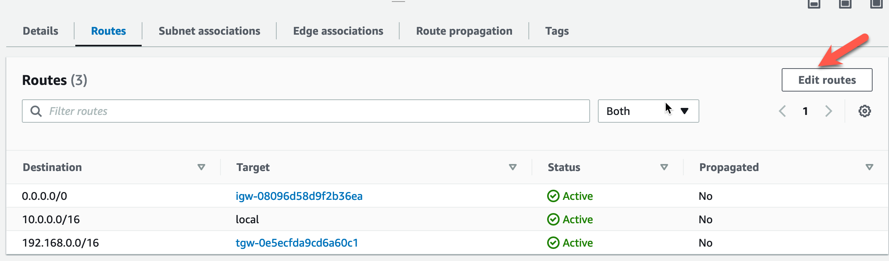
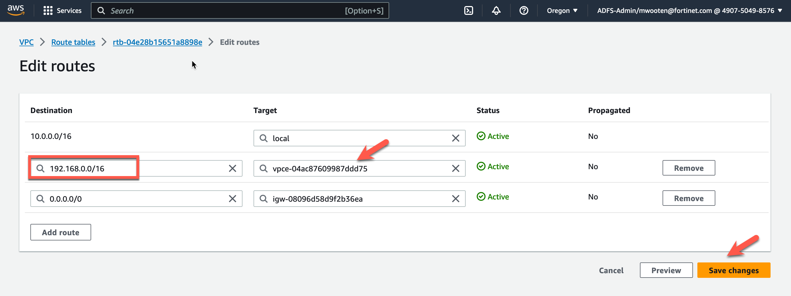
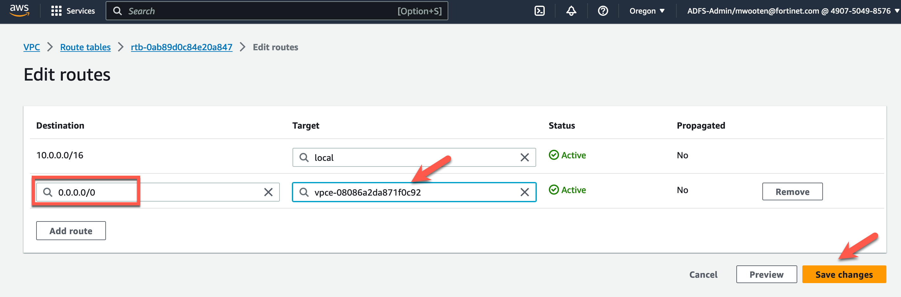

* The initial deployed terraform template deploys an inspection VPC with a FortiManager and FortiAnalyzer and a couple of customer or workload VPC's connected to a Transit Gateway (TGW). This design allows outbound traffic to egress through the NAT Gateways and the option to add various types of AWS load balancers for ingress traffic. The interesting aspect of this design pattern allows many VPC's to share a single FortiGate CNF instance. This design pattern is depicted in this picture:

* The default VPC route tables route the egress traffic to the NAT Gateways and the ingress traffic is directed to the TGW for each Spoke VPC. Traffic that is going to the FortiAnalzyer, FortiManager and Jump Box are routed locally to the EIP associated with each device. This design is a working design, but does not give the FortiGate CNF instance the opportunity to inspect the traffic. We need to change the VPC route tables to force egress and ingress traffic through the GWLB Endpoints we created in the previous task. This give the FortiGate CNF instance the opportunity to inspect ingress and egress traffic. The modified design will look like this:

**Note:** Changes to the route tables are in RED.

* The first change will be to the public route table in the inspection VPC in AZ1. 
* Log into your AWS account and navigate to the [**Console Home**](https://us-west-2.console.aws.amazon.com/console/home?region=us-west-2#).

* First, we need to understand which CNF Endpoint is deployed in each AZ. To do this, click on "Endpoints" in the left pane.

* Then choose one of the CNF Endpoints and click subnets in the lower window.

* From this screen, you can see the subnet id where the Endpoint is deployed. You have a few options here. 
  * You could navigate to the subnet tab on the left navigation pane and check which AZ that subnet is in using the subnet id. 
  * You might notice that the IP address is 10.0.1.54. If you check the network diagram above, you can see that the 10.0.1.0/24 CIDR is in AZ1. 
  * In this case, I included the AZ in the name of the name of the subnet "tec-cnf-lab-inspection-fwaas-az1-subnet" in the terraform that deployed the workshop VPC. It's a useful hint in this case, but that may not be true in other VPC environments. 
  * Nevertheless, this endpoint (vpce-xxxx0c92) is deployed in AZ1 and (vpce-xxxxdd75) is deployed in AZ2. 
  * You might want to add this info to your scratchpad.

* Now let's modify the route tables. Click on "Route tables" in the left pane

* Highlight the Inspection VPC Public Route table named "tec-cnf-lab-inspection-public-rt-az1". 
* Click on the "Routes" tab at the bottom. 
* Click on "Edit routes".

* Click **Edit Routes**

* Modify the target for the East-West Supernet CIDR to point to the GWLB Endpoint in AZ1. This will redirect ingress traffic to the GWLB Endpoint for inspection.
* Click **Save changes**

* Now do the same for the Inspection VPC Public Route table in AZ2. Click **Route Tables**

* Highlight the Inspection VPC Public Route table named "tec-cnf-lab-inspection-public-rt-az2".
* Click on the "Routes" tab at the bottom.

* Click on "Edit routes".

* 

* Modify the target for the East-West Supernet CIDR to point to the GWLB Endpoint in AZ2.
* Click **Save changes**

* Now let's redirect egress traffic coming from the TGW to the GWLB Endpoint for inspection. Click **Route Tables**

* Highlight the Inspection VPC Public Route table named "tec-cnf-lab-inspection-private-rt-az1".
* Click on the "Routes" tab at the bottom.

* Click on "Edit routes".

* 

* Modify the target for the default route (0.0.0.0/0) to point to the GWLB Endpoint in AZ1.
* Click **Save changes**

* Now let's do the same for the egress traffic in AZ2. Click **Route Tables**

* Highlight the Inspection VPC Public Route table named "tec-cnf-lab-inspection-private-rt-az2".
* Click on the "Routes" tab at the bottom.

* Click on "Edit routes".

* 

* Modify the target for the default route (0.0.0.0/0) to point to the GWLB Endpoint in AZ2.
* Click **Save changes**

* The next task will register the FortiGate CNF instance on FortiManager so we can create a security policy and push policy.

* This concludes this section.
