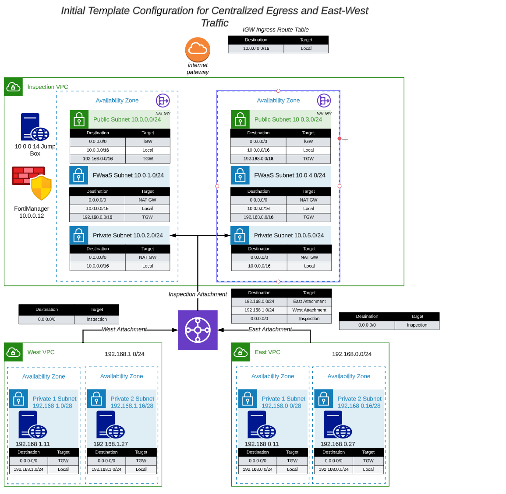

This section provides instructions for deploying the centralized egress vpc using a provided Terraform template.  

The template will create an Inspection VPC in dual availability zones with three (3) subnets in each availability zone. A jump box and a FortiManager will be deployed in the public subnet in the first availability zone. 

In addition to the resources in the inspection vpc, two spoke VPC's will be created and attached to the inspection vpc via a transit gateway. Subsequent tasks in this workshop will deploy a FortiGate CNF instance and associated endpoints to allow for traffic inspection of ingress, egress, and east-west traffic between the spoke VPCs. 

The following network diagram illustrates the layout of the inspection vpc and spoke vpcs:

