* In this task, we will register the FortiGate CNF instance with FortiManager. This will allow us to create and push a security policy to the FortiGate CNF instance.
* Login to the FortiGate CNF console [**FortiGate CNF Home**](https://fortigatecnf.com) with your FortiCloud credentials.

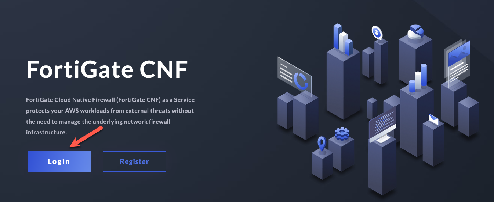
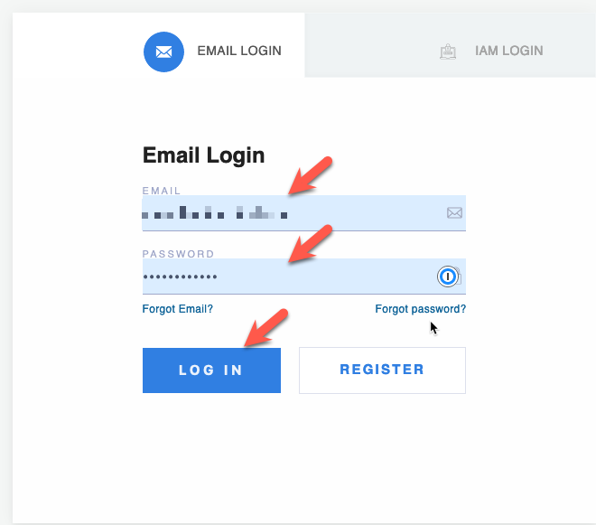

* Click on the proper **Account Selection** choice

* 

* Click on **CNF Instances** in the left pane
* Double-click on the FortiGate CNF instance to open the instance details (or highlight the instance and click **Edit**).

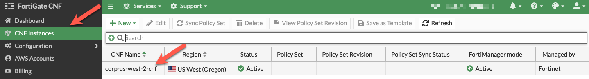

* Click on **Display Primary Fortigate Information** button
* Copy the FortiGate CNF Information into your scratchpad

* 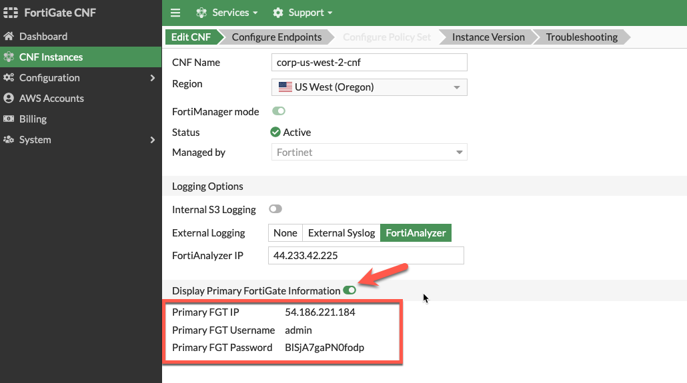

* Open a new browser window and login to the FortiManager IP in your scratchpad
* Click on **Device Manager** 
* Click on **Add Device**

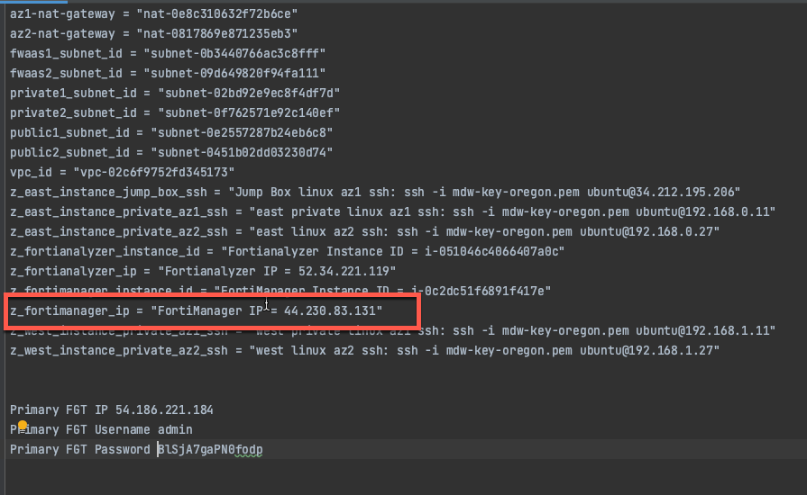

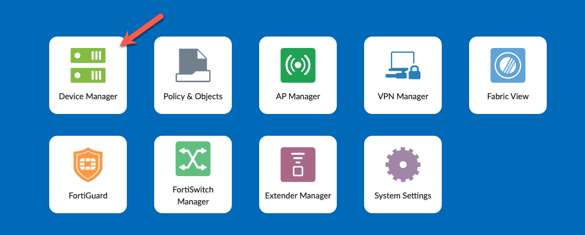
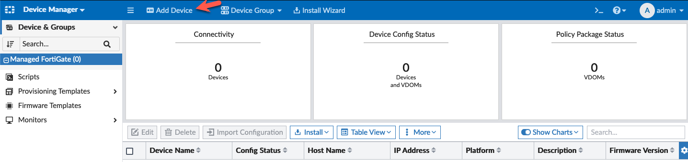

* Click on **Discover Device** in the "Add Device" wizard

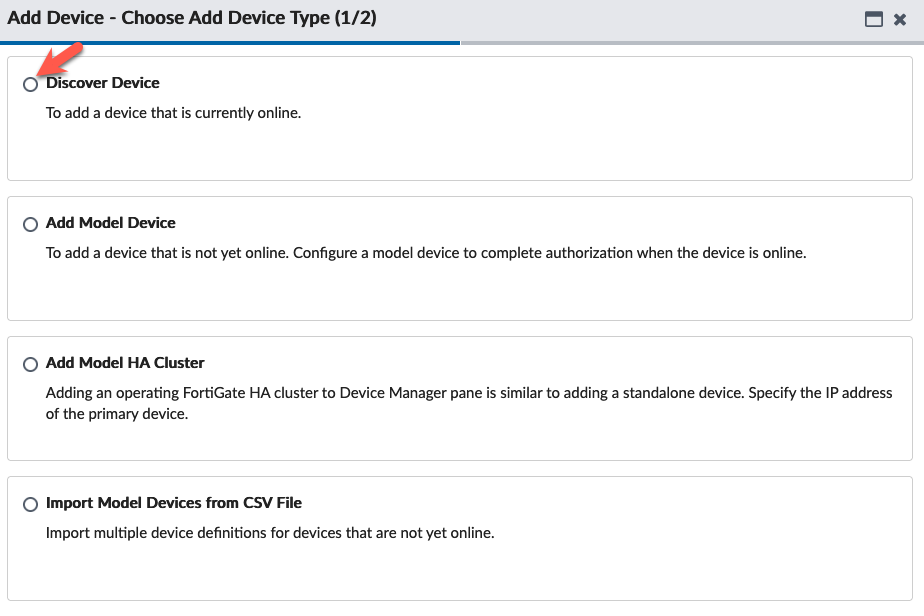

* Use the FortiGate CNF Information in your scratchpad to fill in the IP Address of the FortiGate CNF instance
* Click **Use Legacy Device Login** button
* Enter the **Username** and **Password** for the FortiGate CNF instance
* Click **Next** to continue
* 

* In a production environment, you might want to add a Description, Provisioning Template, Folder and Device Group. For this lab, we will just add a Description.
* Click **Next** to continue

* Wait for the "Device Discovery" process to complete (approximately 1 minute) 
* Click **Import Now** to continue

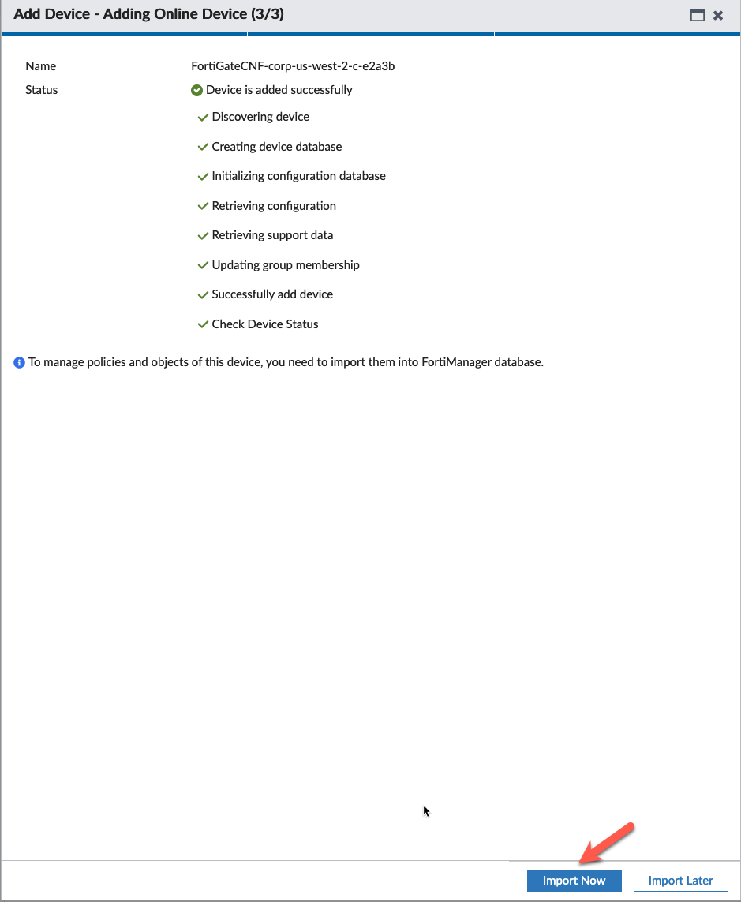

* Click **Import Policy Package** 
* (We are not using "Import AP Profiles or FortiSwitch Templates" in this lab)
* Click **Next** to continue (We are not using "Import AP Profiles or FortiSwitch Templates" in this lab)

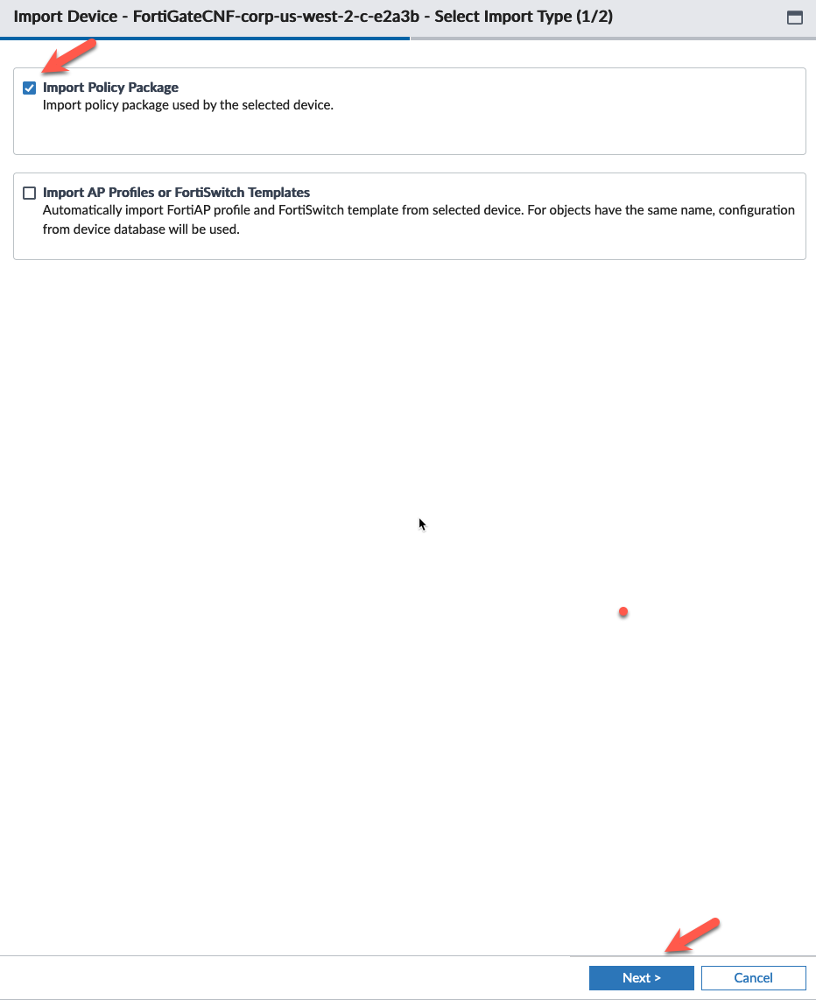

* Confirm **FG-traffic** is highlighted
* Click **Import each VDOM step by step**
* Click **Next** to continue

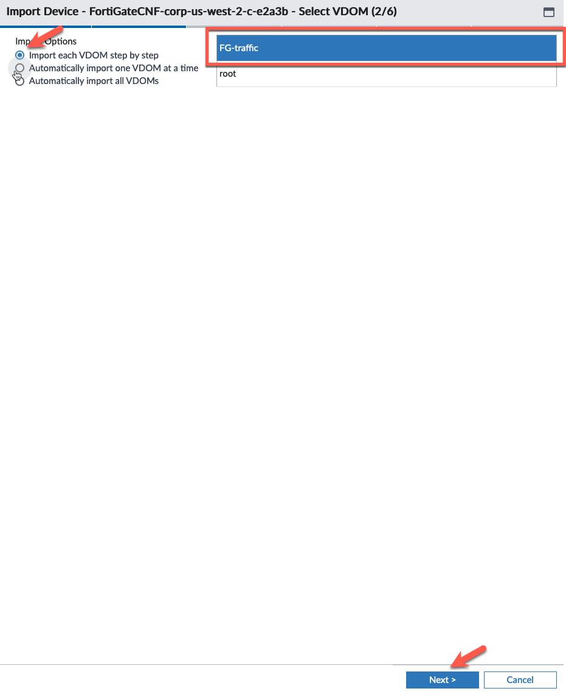

* Click **Import All** for Policy Selection
* Click **Import all objects** for Object Selection
* Uncheck "Add mappings for all unused interfaces"
* Click **Next** to continue

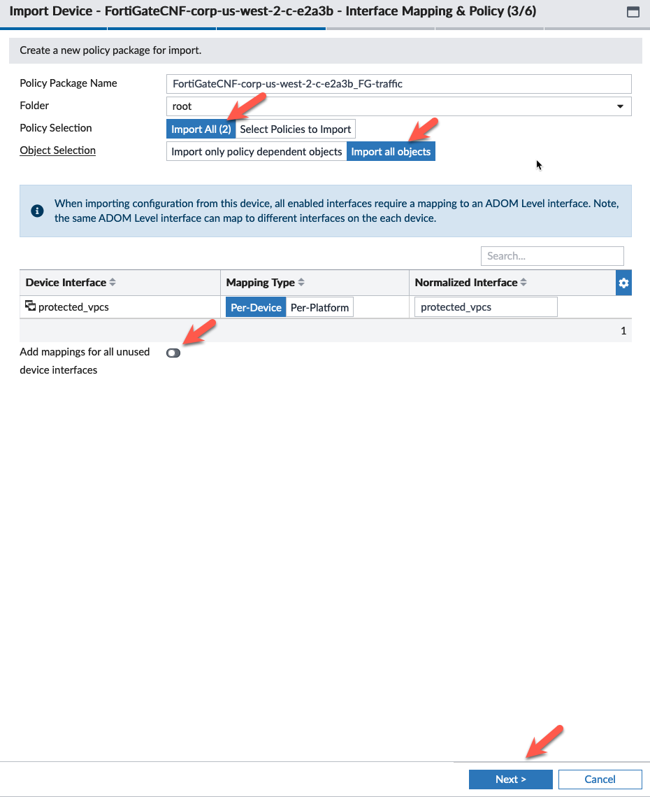

* Click "Use Value From" **FortiGate** for any objects that have conflicts
* Click **Next** to continue

* Expand the conflicts dropdowns if you like 
* Click **Next** to continue

* Verify the "Import Summary" and click **Next VDOM** to continue

* We will not be importing the **root** VDOM. 
* Click **Cancel** to continue

* Verify the "FG-Traffic" VDOM is imported

* Click on Main Menu (upper left corner)
* Click on **Policy & Objects**
* Verify the FortiGate CNF instance has a firewall policy (this should be the default "allow all" policy)

* 
* The next task will register the FortiGate CNF instance on the FortiAnalyzer to allow logging.

* This concludes this section.
