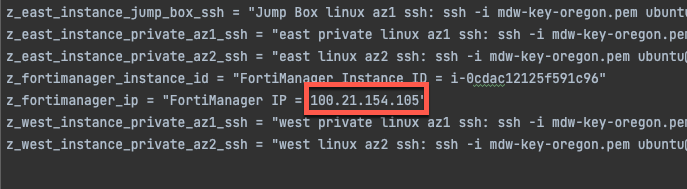
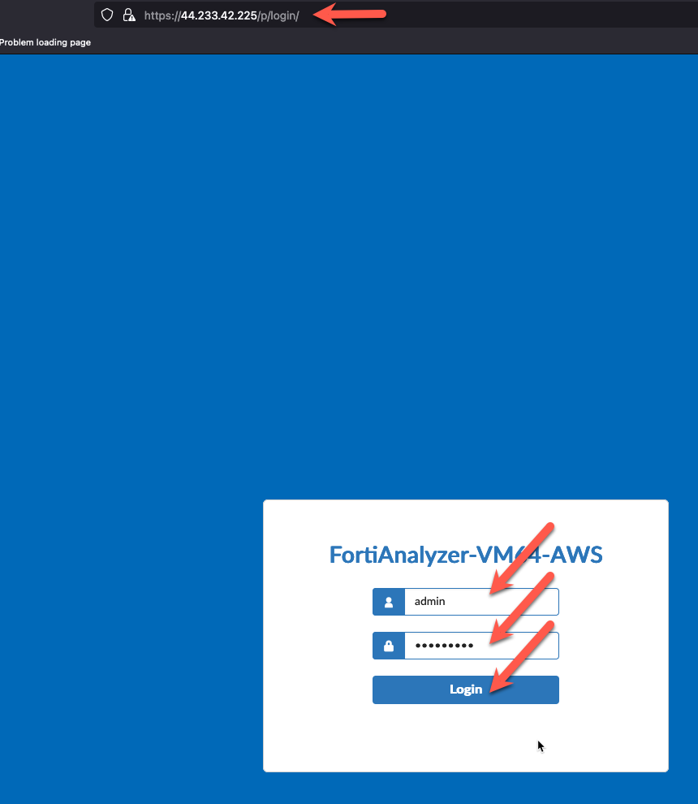
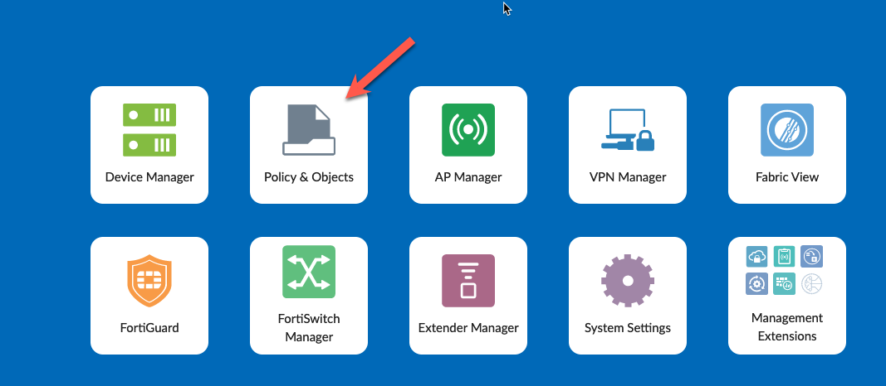
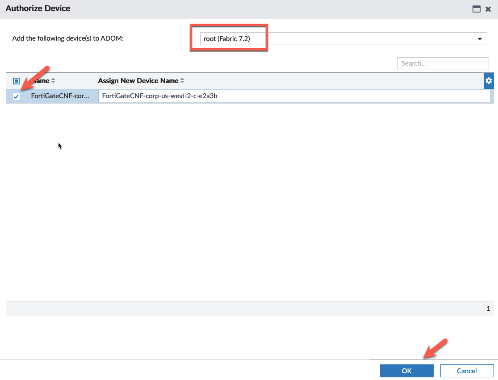
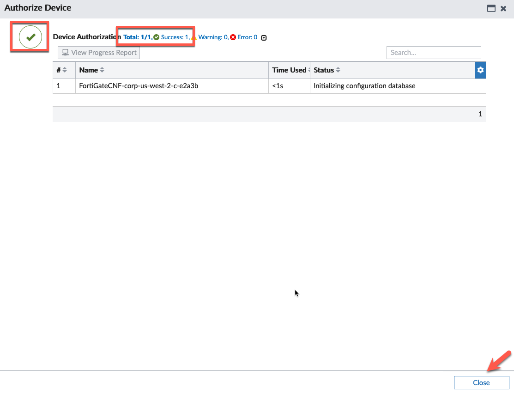

* In this task, we will register the FortiGate CNF instance with FortiAnalyzer. This will allow FortiGate CNF to send logs to the FortiAnalyzer.
* Find the FortiAnalyzer IP Address in your scratchpad.
* Open a new browser window and login to the FortiAnalyzer IP using the credentials you created in Task 11.

* Check the FortiGateCNF instance in the list of devices. If it is not there, wait a few minutes and refresh the browser window.
* Click on **Authorize**
* 

* Highlight the FortiGateCNF instance and authorize the device into the root adom. A production environment might use a different ADOM, but root is sufficient for this workshop.
* Click **OK** to continue

* Verify successful authorization. Click **Close** to Continue

* The next task will create a security policy and push it to the FortiGate CNF instance.

* This concludes this section.
