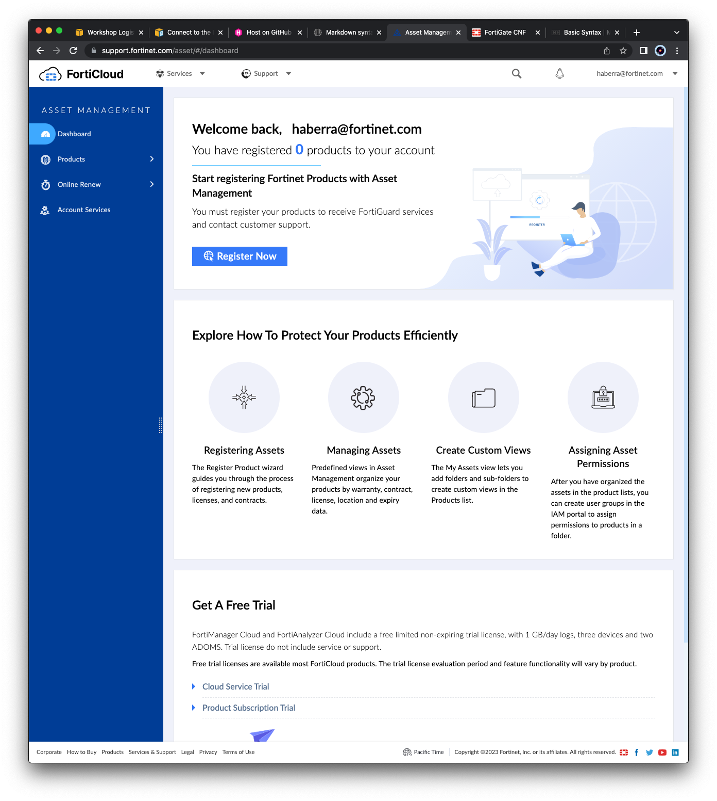
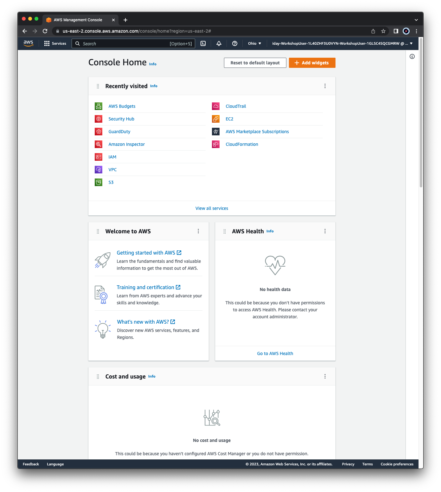
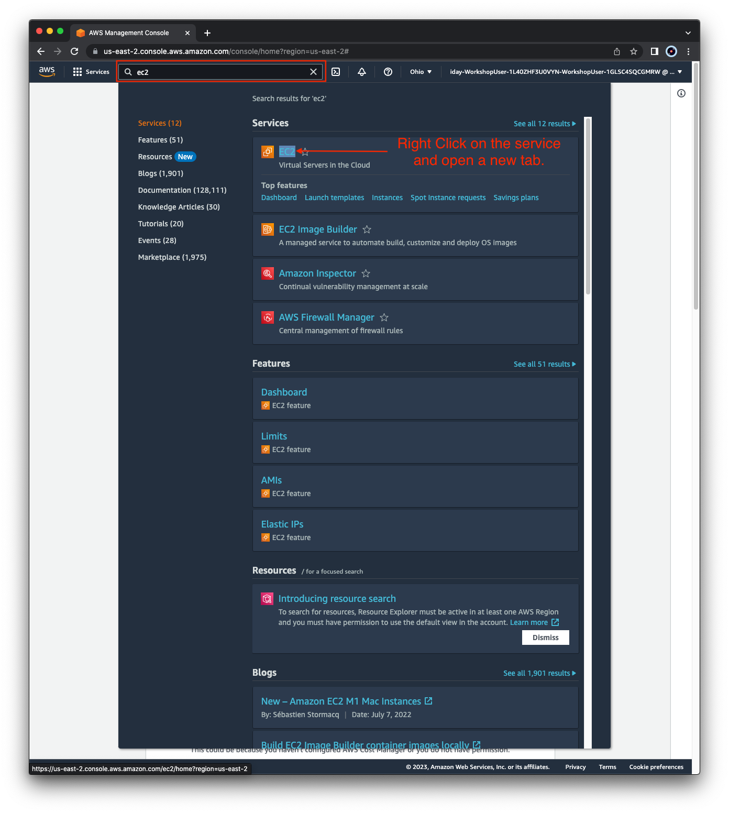

# Workshop Logistics

## Accessing an AWS environment

For the FortiGate CNF Tec Recipe, you will need the following:

  * **AWS sign in link**
  * **IAM User w/ console access**
  * **Password for the IAM User**

## Accessing the FortiGate CNF Console

FortiGate CNF and other SaaS solutions are tied to your [**FortiCloud**](https://support.fortinet.com/). If you do not already have one, please navigate [**here**](https://support.fortinet.com/cred/#/sign-up) and complete the registration process.

Once logged in, you will see your FortiCloud dashboard.

*You will log into the FortiGate CNF console later during the hands on section.*

{}
Please **log out** before proceeding to the next part of the TEC Recipe.
{}

## Navigating the AWS Console

When you first login you will see the Console Home page.

Use the **Search Box** at the top to search for services such as EC2, VPC, Cloud Shell, etc.

When the results pop up, **right click** the name of the service and open the desired console in a new tab. This makes navigation easier.

