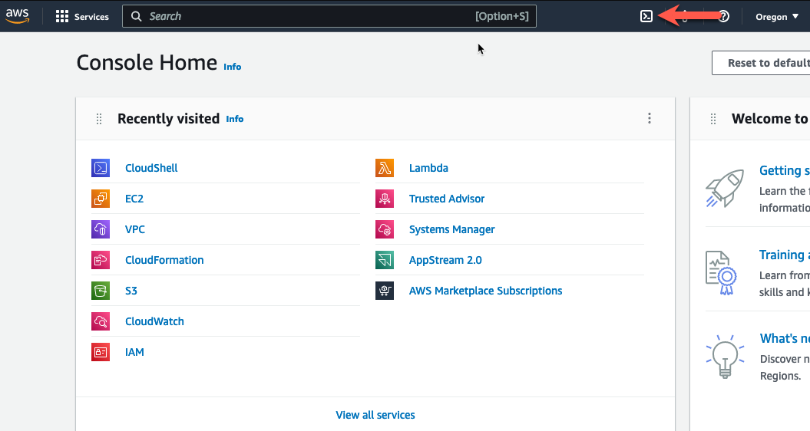
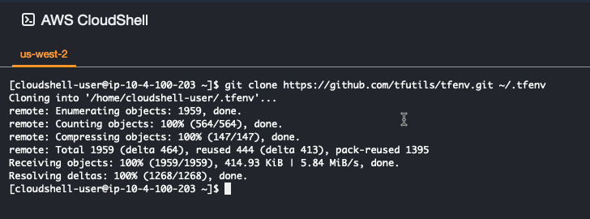
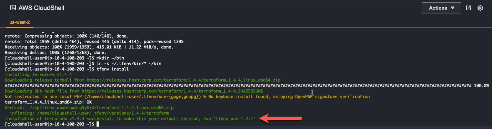
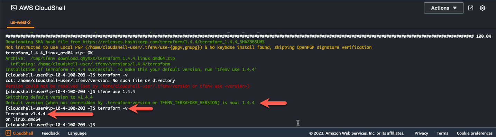

# Task 1: Install Terraform in AWS CloudShell

* Log into your AWS account and navigate to the [**Console Home**](https://us-west-2.console.aws.amazon.com/console/home?region=us-west-2#).
* Click on the AWS CloudShell icon on the console navigation bar

* We are going to use the Terraform Version Manager to help install Terraform
* Clone the Terraform Version Manager repository

  > git clone https://github.com/tfutils/tfenv.git ~/.tfenv

* Make a new directory called ~/bin

  > mkdir ~/bin

* Make a symlink for tfenv/bin/* scripts into the path ~/bin 

  > ln -s ~/.tfenv/bin/* ~/bin

* With the Terraform Version Manager installed, we can now install Terraform. 

  > tfenv install 
  
  

* This will install the latest version of Terraform for you. Take note of the installed version of terrform. In this case, the default version is 1.5.3. 
* To make this version the default version, use the following commmand
  
  > tfenv use 1.5.3
  
* Verify you are using the proper version of terraform 

  > terraform -v 
  
   

* This concludes this section.
