# Task 9: Cleanup

* When finished experimenting with the First VPC, let's cleanup the CNF Endpoints, the CNF Instance, and the Workload-VPC. Start by removing all routes in the Workload VPC that point to the CNF endpoints.
* * Log into your AWS account and navigate to the [**Console Home**](https://us-west-2.console.aws.amazon.com/console/home?region=us-west-2#).
* Click on the VPC icon

* Click on "Route tables" in the left pane

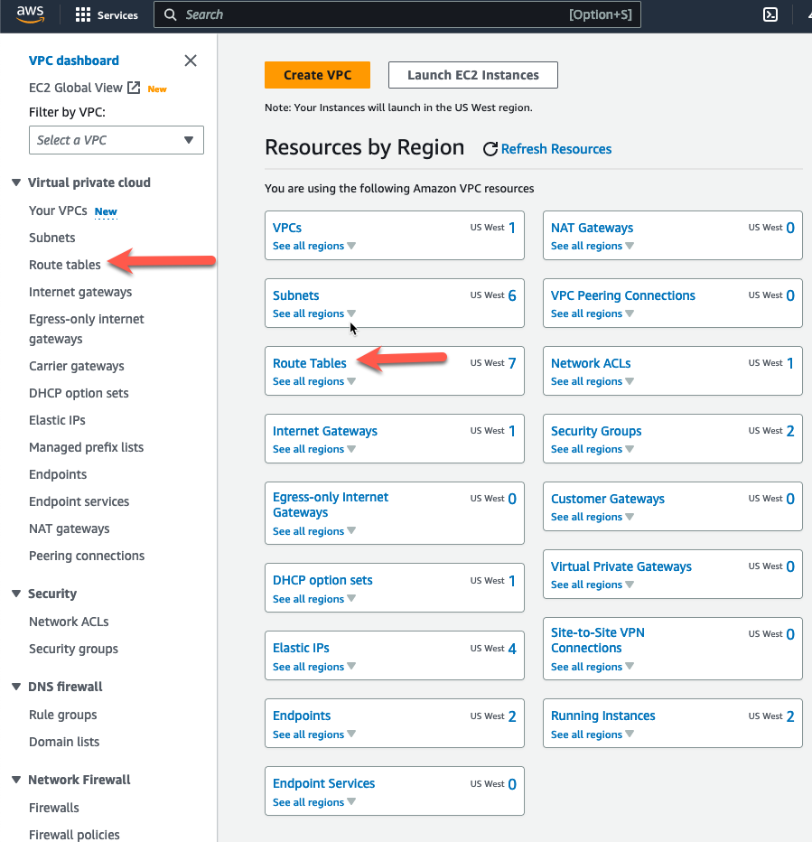

* Highlight the IGW Ingress Route table named "cnf-dist-rec-igw-rt". 
* Click on the "Routes" tab at the bottom. 
* Click on "Edit routes".

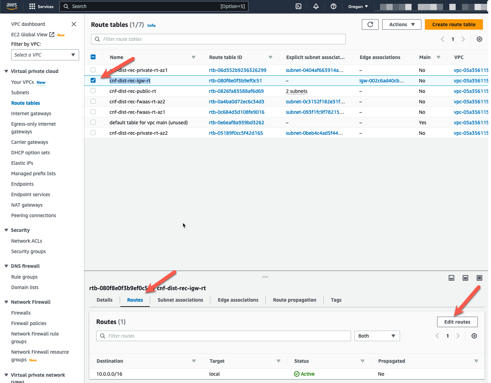

* Remove the four routes that have a "Target" that points to a "vpce"
* Click "Save Changes"
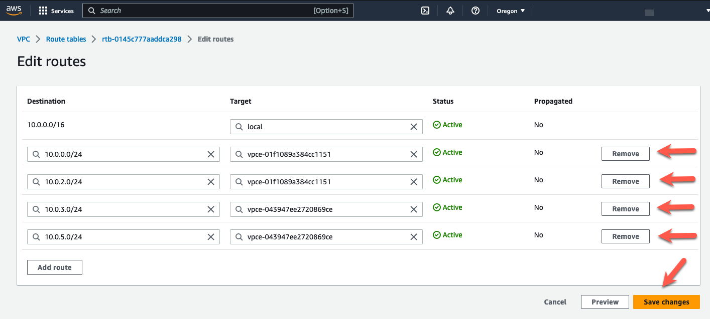

* Highlight the private route table for AZ1.
* Click the "Routes" tab at the bottom
* Click "Edit routes"

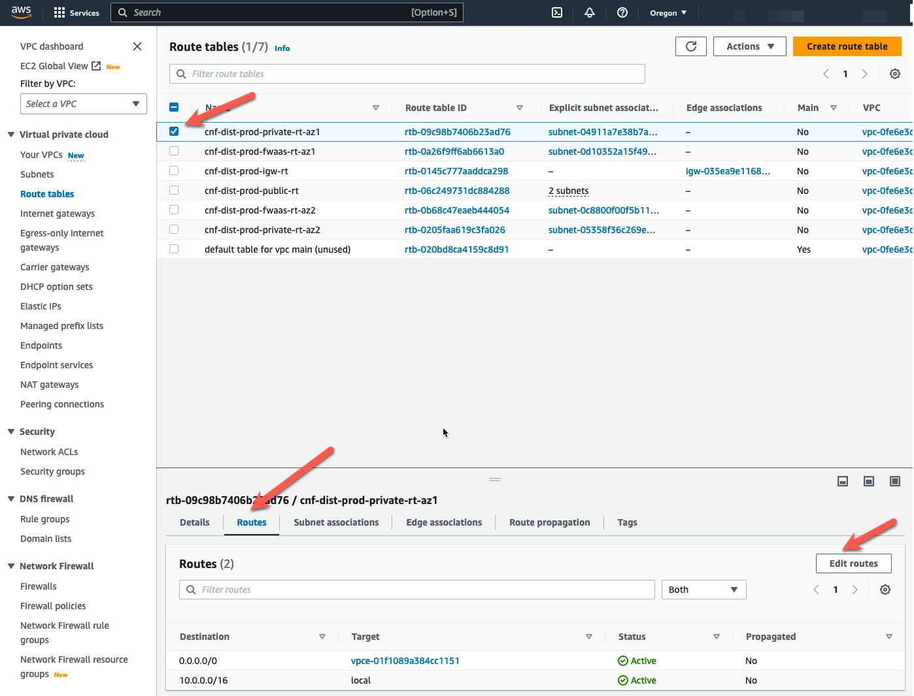

* Change the default route target to the IGW in the VPC.
* Click "Save changes"

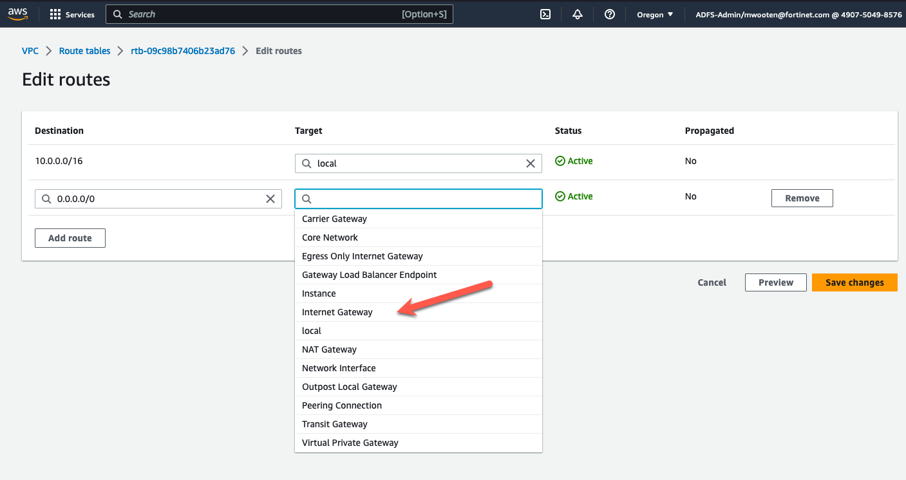
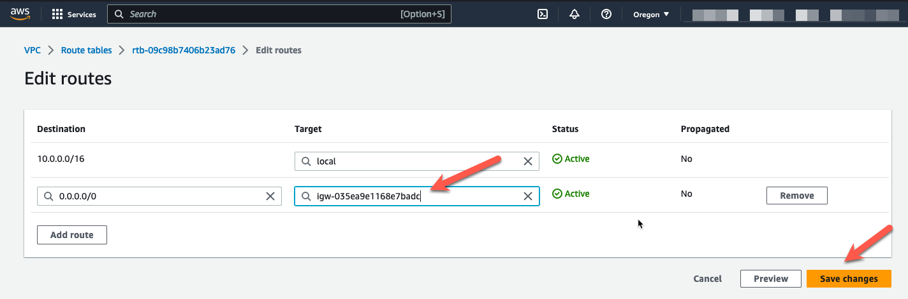

* Navigate back to the "Route tables" screen and change the default route for the private subnet in AZ2. 
* Click the "Routes" tab at the bottom
* Click "Edit routes"
* Change the default route target to the IGW in the VPC.
* Click "Save changes"

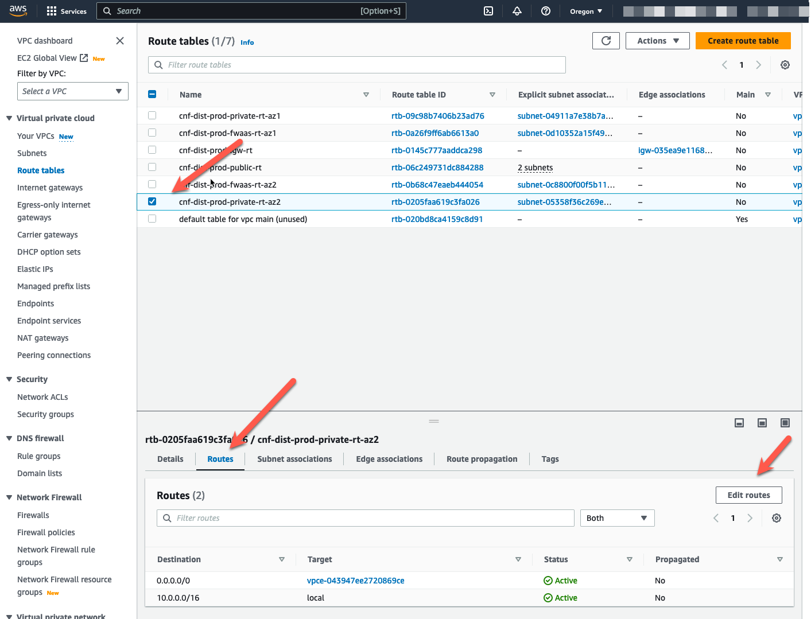
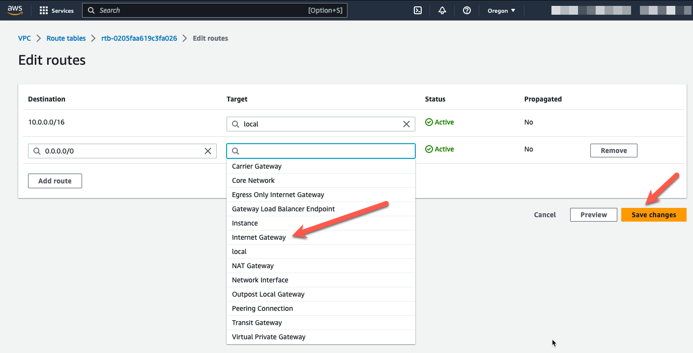

* Cleanup the Fortigate CNF endpoints and instance
** Navigate back to https://fortigatecnf.com
** Click on CNF Instances
** Double-click the CNF instance we created

** Advance the menu to "Configure Endpoints"
** Highlight each endpoint and click "Delete"

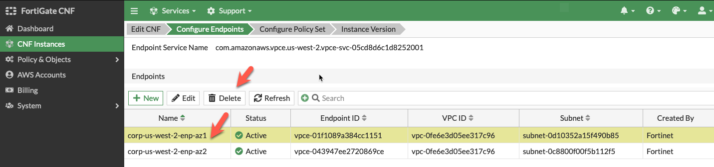
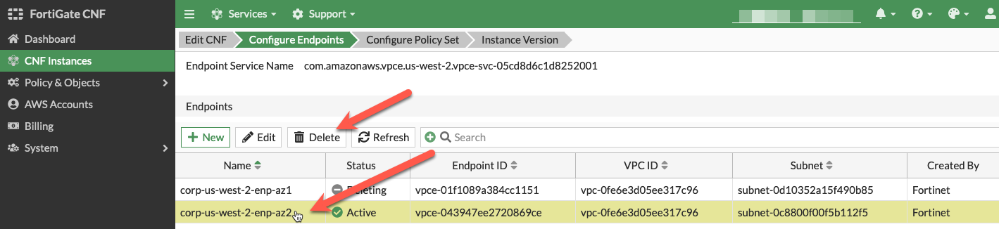

** Click "Refresh" periodically and wait for both endpoint to disappear (~5 min).
** Advance the menu tab to Configure Endpoints

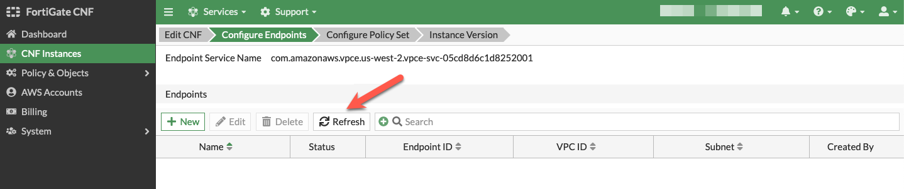

** Click on "CNF Instances"
** Highlight the CNF Instance 
** Click "Delete"
** Wait approximately 10 minutes for the CNF instance to finish deleting

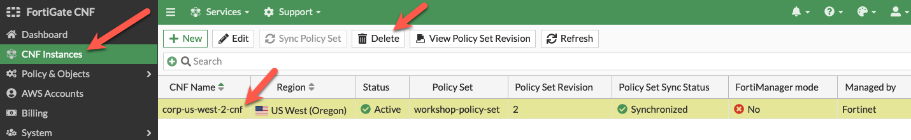

* Log into your AWS account and navigate to the [**Console Home**](https://us-west-2.console.aws.amazon.com/console/home?region=us-west-2#).
* Click on the "AWS Cloudshell" icon
* cd tec-recipe-distributed-ingress-nlb/
* terraform destroy --auto-approve

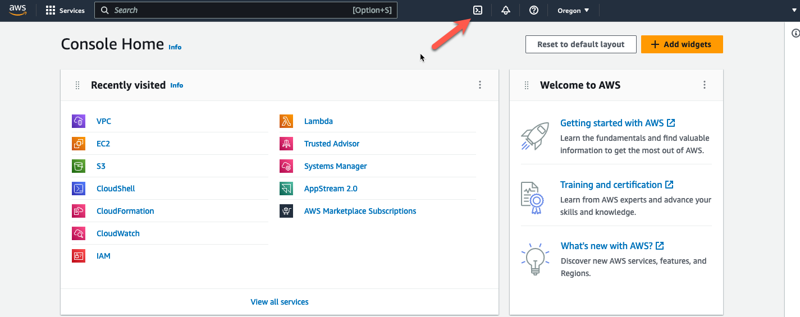
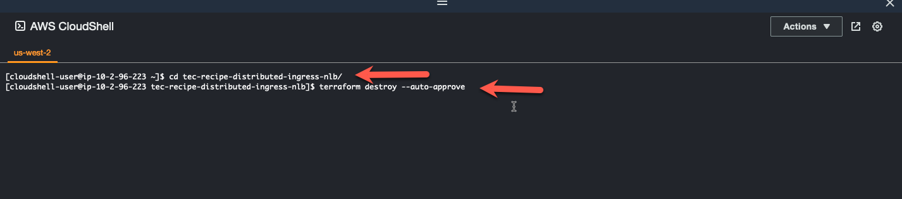

* Wait for "destroy complete"

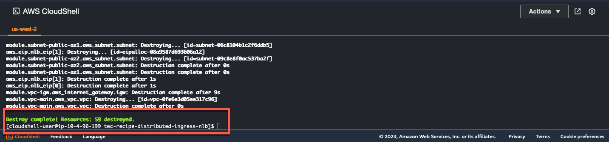

* This concludes this section.
