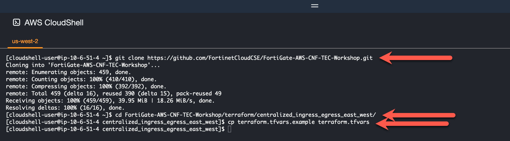
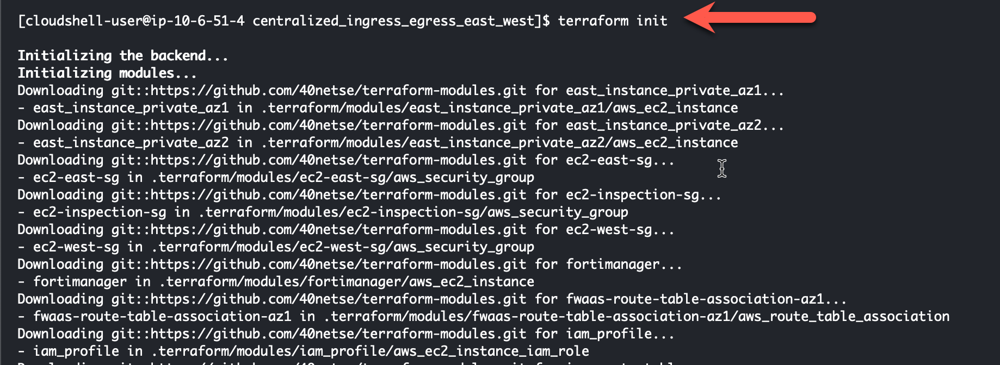

# Task 10: Create a Centralized Egress Workload VPC using Terraform in AWS CloudShell 

This lab will deploy two dual AZ VPC's with an instance in each private subnet. The initial route tables will route egress traffic to a NAT Gateway for access to the Internet. Each VPC will also be connected to a Transit Gateway (TGW) for East-West connectivity between the VPC's. 

The terraform template will also deploy a "Jump Box" and a FortiManager in AZ1 of the VPC marked "Inspection". This "Jump Box" instance will have a Public IP associated with it and will allow us to SSH into that instance and then "jump" to any other instance within the pair of VPC's. The FortiManager will be used to manage the Fortigate CNF Instance after deployment. 

Before we deploy a Fortigate CNF instance (and associated Endpoints), all egress traffic and East-West traffic will be allowed. We will then deploy a Fortigate CNF instance and change the routing to send all traffic through the "Inspection VPC" where the traffic will be sent to the Fortigate CNF for inspection. We will then build a Fortigate CNF security policy that allows some traffic and blocks some traffic.

The VPC specifics will look like this:

{}
In a production environment, deploying a FortiManager with a Public IP and exposed to the Internet is not "best practice". Best practice, would place this FortiManager behind a firewall in a secure VPC or in an on-prem secured location. This lab is deploying FortiManager in this fashion to simplify the deployment and demonstrate the use of FortiManager capabilities to control Fortigate CNF.
{}

* Log into your AWS account and navigate to the [**Console Home**](https://us-west-2.console.aws.amazon.com/console/home?region=us-west-2#).
* Click on the AWS CloudShell icon on the console navigation bar

* If your repository is no longer on your cloudshell account from Task 3-2 before, clone a repository that uses terraform to create a distributed ingress workload vpc

  > git clone https://github.com/40netse/cnf-tec-workshop-terraform.git

* Change directory into the newly created repository for distributed_ingress_nlb

  > cd cnf-tec-workshop-terraform/centralized_ingress_egress_east_west
  
* Copy the terraform.tfvars.example to terraform.tfvars

  > cp terraform.tfvars.example terraform.tfvars
  

* Edit the terraform.tfvars file and insert the name of a valid keypair in the keypair variable name and save the file

* Use the "terraform init" command to initialize the template and download the providers

  > terraform init

* Use "terraform apply --auto-approve" command to build the vpc. This command takes about 5 minutes to complete, so this is a good time for a break.

  > terraform apply --auto-approve

* When the command completes, verify "Apply Complete" and valid output statements.
  * Make note of the ssh line labeled "Jump Box". None of the Linux instances have Public IPs and will not be directly accessible from PC you are running the LAB from. The "Jump Box" VM does have a Public IP. We will use this instance to access the other instances in the workload VPC.
  * Copy the "Outputs" section to a scratchpad. We will use this info throughout this workshop.

* This concludes this section.
