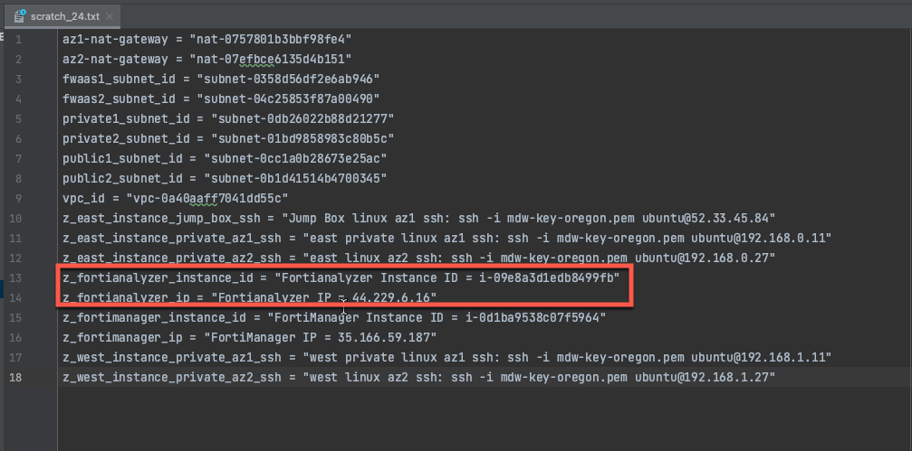
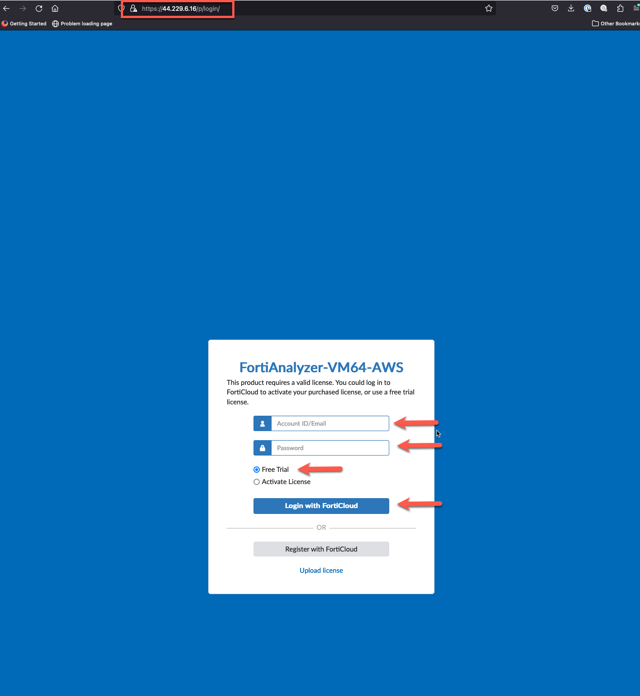

# Task 11: Check Connectivity from Jump Box

* Let's check connectivity to a couple of instances. First, let's copy our key pair file to the jump box. Make note of the Public IP of the jump box from the template output section we copied earlier. 
* Scp the key pair file using the jump box public IP. 

* Scp the key pair file using the jump box public IP.
* ssh to the jump box

  > scp -i "path to key file" "path to key file" ubuntu@"public ip":~
  
  > ssh -i "path to key file" ubuntu@"public ip"

* Let's ping each instance in the EAST and WEST VPC to make sure we have connectivity. Feel free to ssh into each instance and check egress or EAST->WEST connectivity. It's all there and everything is wide open. 

* Now let's deploy a Fortigate CNF to control flows for each Linux instance.

* This concludes this section.
