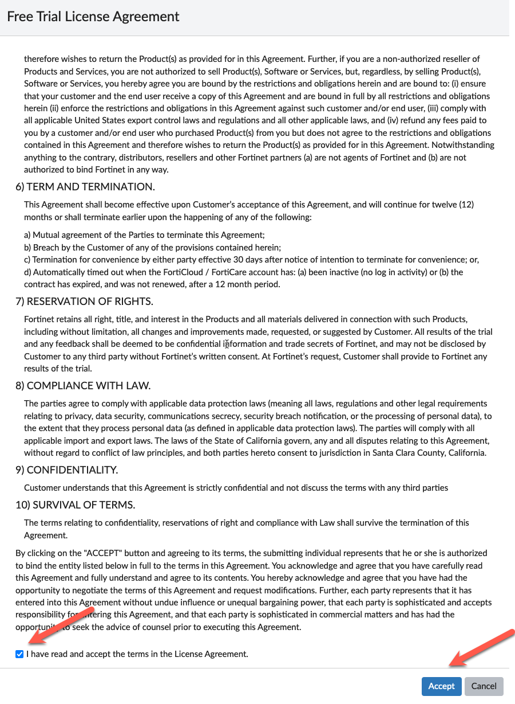
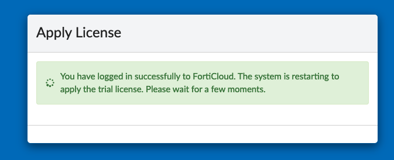
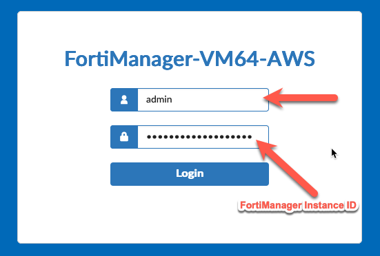
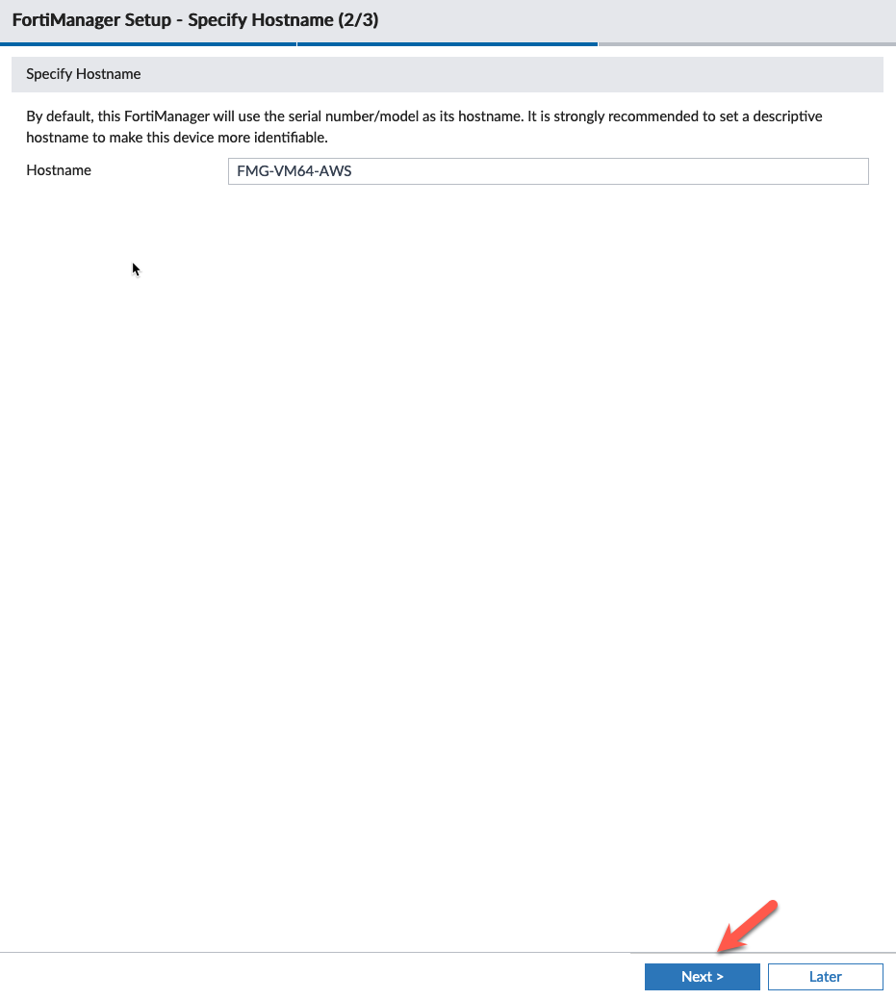
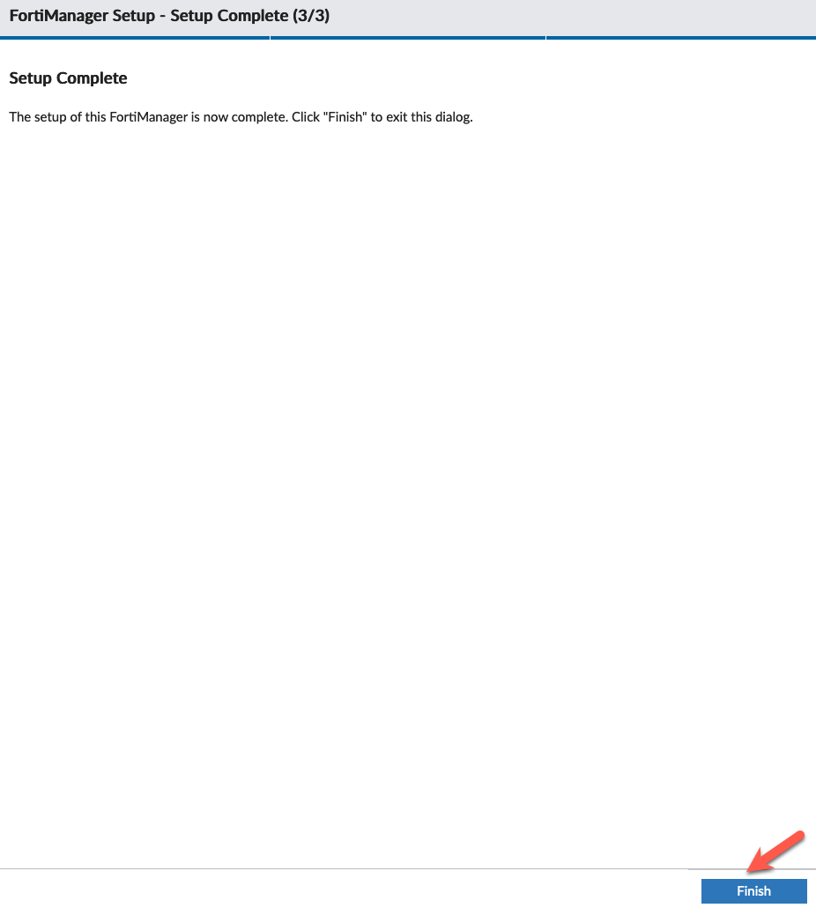
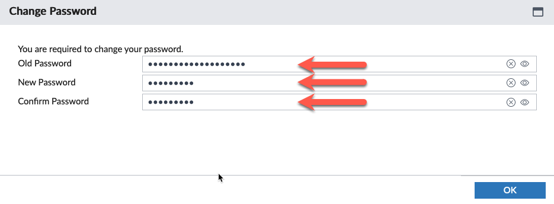

# Task 12: Deploying CNF Instances and GWLBe endpoints

* In the FortiGate CNF console, navigate to CNF instances and click **New**.

* Provide a name for the CNF instance
* select **us-west-2** for the region
* select **FortiManager Mode**, select **External Syslog** for the log type, and insert the  **Jump Box Public IP** you wrote down earlier when you created the Workload VPC. 

* This time, we will deploy the Fortigate CNF endpoints at the same time we are deploying the CNF instance (save time). 
  * Click **New** under the **Endpoints** section

* Give the Endpoint a name
* We already "on-boarded" the account in the previous lab, so choose your account from the dropdown
* Click the "Inspection" VPC ID from the dropdown. 
* Unclick the "all subnets" button. This will restrict the subnet choices to the properly tagged subnets (the template tagged the correct choices).
* Choose the "fwaas" subnet associated with AZ1
* Click **OK** at the bottom of the page

{}
**Note:** In order for FortiGate CNF to successfully create a GWLBe in a subnet, **the subnet must be properly tagged**.  The subnet needs a Tag ***Name = fortigatecnf_subnet_type*** and Tag ***Value = endpoint***. Otherwise you will see an error that the subnet ID is invalid.  The subnets below have already been tagged properly. **In this example environment, the subnets above have already been properly tagged.**
{}

Now repeat the process for the endpoint in AZ2
* Give the Endpoint a name
* We already "on-boarded" the account in the previous lab, so choose your account from the dropdown
* Click the "Inspection" VPC ID from the dropdown. 
* Unclick the "all subnets" button. This will restrict the subnet choices to the properly tagged subnets (the template tagged the correct choices).
* Choose the "fwaas" subnet associated with AZ2

* Now click **OK** on the "Create CNF" screen to start the creation of the CNF Instance and associated Endpoints
{}
The CNF Instance should show up as **active after roughly 10 minutes** (Now is a great time for a break :) ).
{}

* Highlight the CNF Instance and click **Edit**. 

* Click **Display Primary FortiGate Information**
* Copy **Primary FGT IP**, **Primary FGT Username**, **Primary FGT Password** to your scratchpad. This information will be used when we add the FortiGate CNF instance to FortiManager as a "managed device".

* Step through the tabs to verify the Fortigate CNF Instance and Endpoints deployed correctly.

{} The next task will be to login to FortiManager and provide initial setup.
{}

* This concludes this section.
