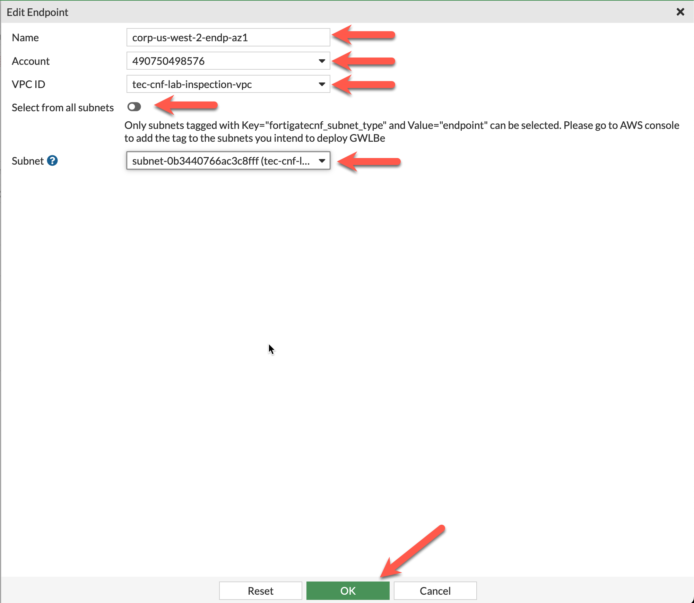
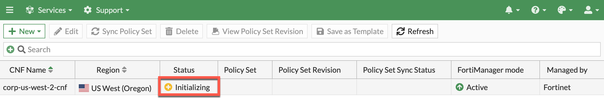
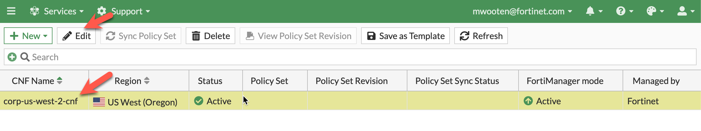

# Task 13: Login to FortiManager and provide initial configuration

Let's login to the FortiManager. 
  * From Console Home, click on EC2
  * From EC2, click on Instances (running)
  * Choose the FortiManager instance.
  * Click **Details** tab if it isn't already highlighted.
  * Click the **open address** link associated with the Public IP of the FortiManager.

* Accept the self-signed certificate warnings

* Login to the FortiManager login screen with your FortiCloud account credentials
* Click the **Free Trial** license option.
* Click **Login with FortiCloud**

* Accept the License Agreement.

* FortiManager will restart and apply the trial license. 

* After FortiManager reboots and the Web Interface refreshes, Accept the Pre-Login Disclaimer

* Retrieve the instance id from the AWS EC2 screen for FortiManager.
* Use "admin" as the username and the instance-id as the password to login to FortiManager.
* Click **Begin** to step through the initial FortiManager setup screens.
* Accept default Hostname (or change it if you like).
* Click **Finish** to complete setup.

* Change Password from default "instance-id". 
  * Insert "instance-id"
  * Insert New Password and Confirm Password 
  * When you change the default password, Fortimanager will logout and force you to re-enter the new password.
  

{} The next task will be to add our Fortigate CNF instance to our FortiManager as a managed device.
{}

* This concludes this section.
