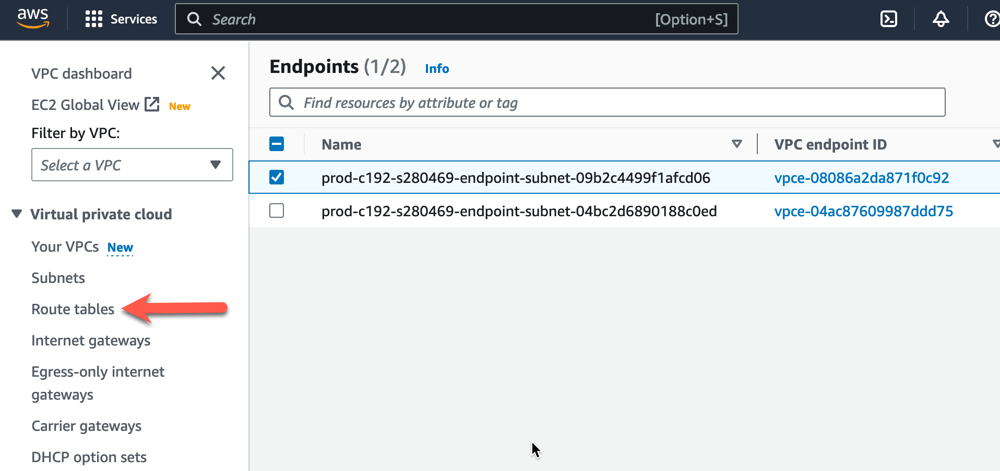
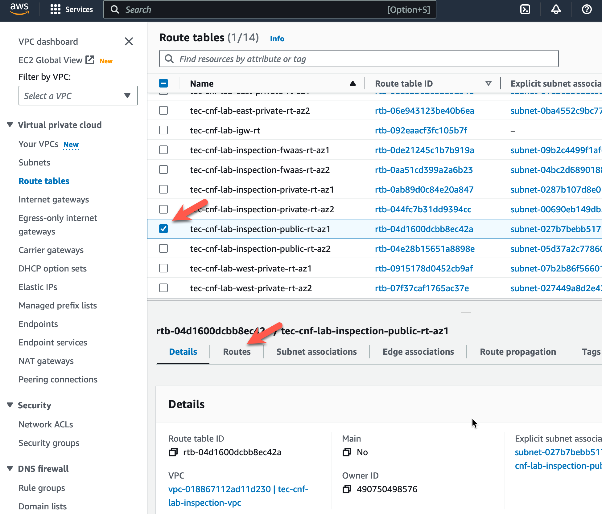
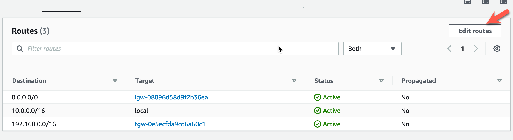
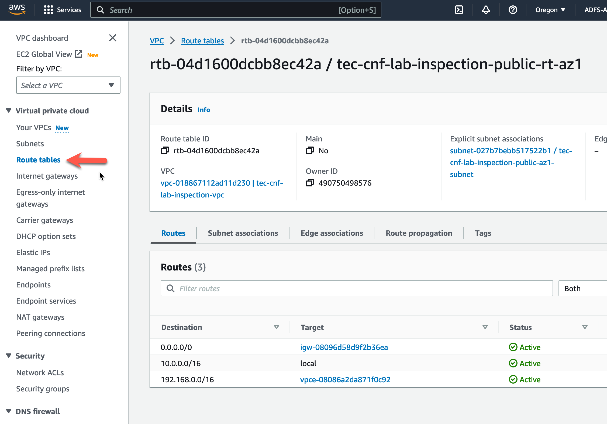
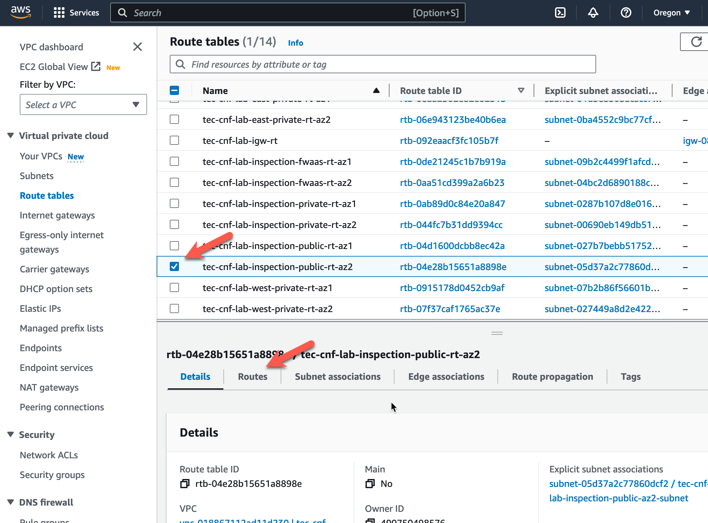
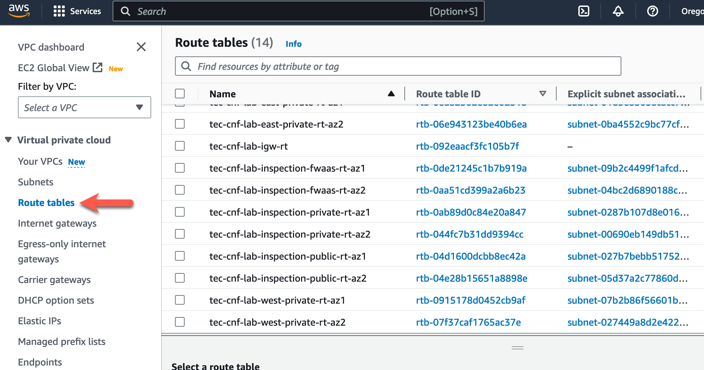
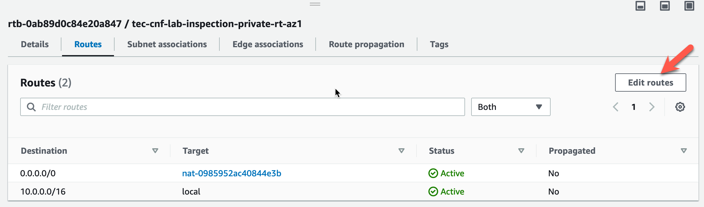

# Task 14: Add FortiGate CNF instance as a managed device on FortiManager

FortiGate CNF Documentation Link: [**FortiGate CNF Admin Guide**](https://docs.fortinet.com/document/fortigate-cnf/latest/administration-guide/239022/introduction).

* On the initial FortiManager screen, click **Device Manager**
* On the **Device Manager** screen, click **Add Device**

* On the **Device Manager** screen, click **Add Device**

* Click **Discover Device** on "Add Device" screen.

* Fill in the **IP Address** with the information we saved from the FortiGate CNF Primary Information screen in Task 12.
* Click **Use Legacy Device Login**
* Fill in the **Primary FGT Username** information we saved from the FortiGate CNF Primary Information screen in Task 12.
* Fill in the **Primary FGT Password** information we saved from the FortiGate CNF Primary Information screen in Task 12.
* Click **Next** at the bottom of the screen.

* Verify the "Discover Device Information". If everything looks good, Click **Next** at the bottom of the screen.

* Wait for the progress bar to show the device was added successfully.
* Click **Import Now** to complete the "Add Device"
* Click **Import Policy Package**. 
* If this was a production CNF instance and it was being used as an Access Point or Switch manager, hightlight **Import AP** box and import those profiles also. This workshop will not include this option.
* Click **Next** at the bottom of the screen.

* Highlight **Import each VDOM step by step** and FG-traffic. You do not need to import the "root" VDOM.
* Click **Next** at the bottom of the screen.

* The defaults will work for this workshop. In a production environment, understand the options by reading the FortiManager Admin Guide.
* Click **Next** at the bottom of the screen.

* If you have imported devices/policy packages into this FortiManager, the import may inform you that you are importing duplicate objects. 
* Click **Next** to continue (if required).

* Wait for VDOM to be successfully imported. 
* Click **Next VDOM**

* The "root" VDOM does not need to be imported. 
* Click **Cancel** at the bottom of the screen.

* The FortiGate CNF instance is imported. Click on summary and detail screens to verify information.

FortiGate CNF Management Restrictions Link: [**FortiGate CNF Admin Guide**](https://docs.fortinet.com/document/fortigate-cnf/latest/administration-guide/792912/management-restrictions).

* Make note of the **Management Restrictions** found in the FortiGate CNF Admin Guide

{} 
The next task will be to build our Fortigate CNF Security Policy from FortiManager and "sychronize" with the FortiGate CNF instance.
{}

* This concludes this section.
