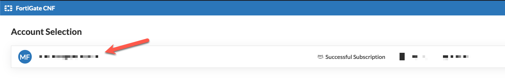
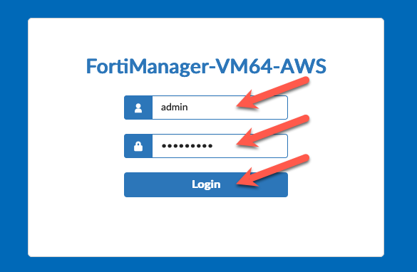
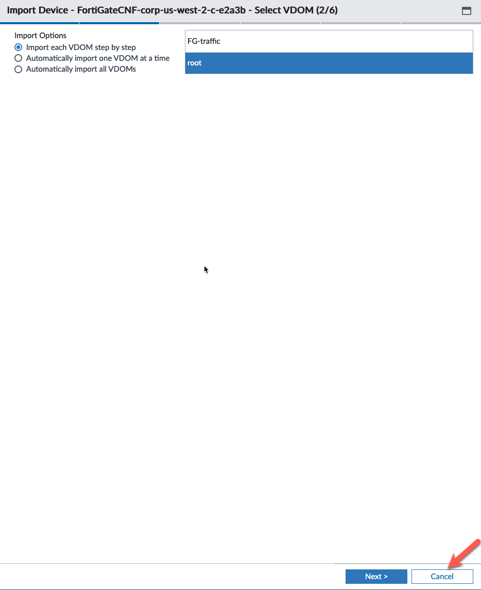

# Task 15: Modify VPC Routing to redirect traffic to FortiGate CNF for inspection

Now we have a FortiGate CNF and Endpoints deployed into the inspection VPC. However, the VPC routing tables are not directing any traffic to the CNF Instance for inspection.

Initially, the Inspection VPC is configured to route all egress traffic coming from the East-West VPC's through the TGW to the NAT GW and then to the Internet Gateway which provides access to the Internet. For connections that egressed out through NAT Gateway, response traffic is passed back through the NAT Gateway and routed back to the TGW via the Public Route table that contains the NAT Gateway. 

The tricky part of all this is avoiding cross-AZ traffic and the cost associated with sending traffic cross-AZ. To avoid this, the route tables in each AZ will direct traffic to the NAT Gateway that is deployed in the same AZ. Once we modify the route tables to send traffic to the FortiCNF endpoints, we need make sure the route tables are directing the traffic to the endpoint in the same AZ. You can figure out which NAT Gateway and which endpoint is in each AZ, but it requires some careful inspection in the AWS console. I also provided a bash script inside terraform repository we cloned into CloudShell. This script will query the Inspection VPC and output the information you need to make the NAT Gateway/Endpoint/Route Table matches easier.

To run the script:

* From Console Home, click on the Cloudshell icon.

* change directory to the repository directory

    > cd cnf-tec-workshop-terraform/centralized_ingress_egress_east_west/
  > 
* run the dump_workshop_info.sh

    > ./dump_workshop_info.sh 

* Copy this information to your scratchpad to reference as we change the route tables.

Let's redirect traffic to allow the FortiGate CNF instance to inspect. 

Let's redirect Egress traffic for AZ1 first. First the "Private" route tables coming from the TGW.

  * From Console Home, click on **VPC**

  * From the VPC Dashboard, click on **Route Tables** on left pane or **Route Tables** on the Resources by Region screen

  * Modify the **inspection-private-rt-az1** route table by highlighting the correct route table
  * Click **Routes** in the lower pane
  * Click **Edit routes** 

  * Change the Target of the default (0.0.0.0/0) to the VPC Endpoint in AZ1. You can find this in your scratchpad.

  * Click **Add Route** and make the **Destination** the subnet where the Jump Box and the FortiManager are deployed (10.0.0.0/24) and the **Target** the VPC endpoint in the same AZ. We need this "more specific" route to send traffic coming from the East-West VPCs through the VPC endpoint and allow FortiGate CNF to inspect the traffic in both directions. Without this route, we will create an asymetric routing issue and response traffic will not be allowed through the firewall.
  * Click **Save changes**

Now let's make the same change for AZ2

  * Click **Route tables** to get back to the main route table screen

  * Modify the **inspection-private-rt-az2** route table by highlighting the correct route table
  * Click **Routes** in the lower pane
  * Click **Edit routes**

  * Change the Target of the default (0.0.0.0/0) to the VPC Endpoint in AZ2. You can find this in your scratchpad.

  * Click **Add Route** and make the **Destination** the subnet where the Jump Box and the FortiManager are deployed (10.0.0.0/24) and the **Target** the VPC endpoint in the same AZ.
  * Click **Save changes**

No need to modify the FWaaS route tables. 

The default route sends egress traffic to the NAT Gateway. 

Ingress traffic that is going to the EAST-WEST VPC's is sent to the TGW. 

That is exactly what we want.

Now let's modify the Public Route Table for AZ1

  * Modify the **inspection-public-rt-az1** route table by highlighting the correct route table
  * Click **Routes** in the lower pane
  * Click **Edit routes**

  * Change the Target of the Spoke VPC CIDR Route (192.168.0.0/16) to the VPC Endpoint in AZ1. You can find this in your scratchpad.
  * Click **Save changes**

  * Click **Route tables** to get back to the main route table screen

Now let's modify the Public Route Table for AZ2

  * Modify the **inspection-public-rt-az2** route table by highlighting the correct route table
  * Click **Routes** in the lower pane
  * Click **Edit routes**

  * Change the Target of the Spoke VPC CIDR Route (192.168.0.0/16) to the VPC Endpoint in AZ2. You can find this in your scratchpad.
  * Click **Save changes**

  * Click **Route tables** to get back to the main route table screen

{}
The next task will be to build our Fortigate CNF Security Policy from FortiManager and "sychronize" with the FortiGate CNF instance.
{}

* This concludes this section.
