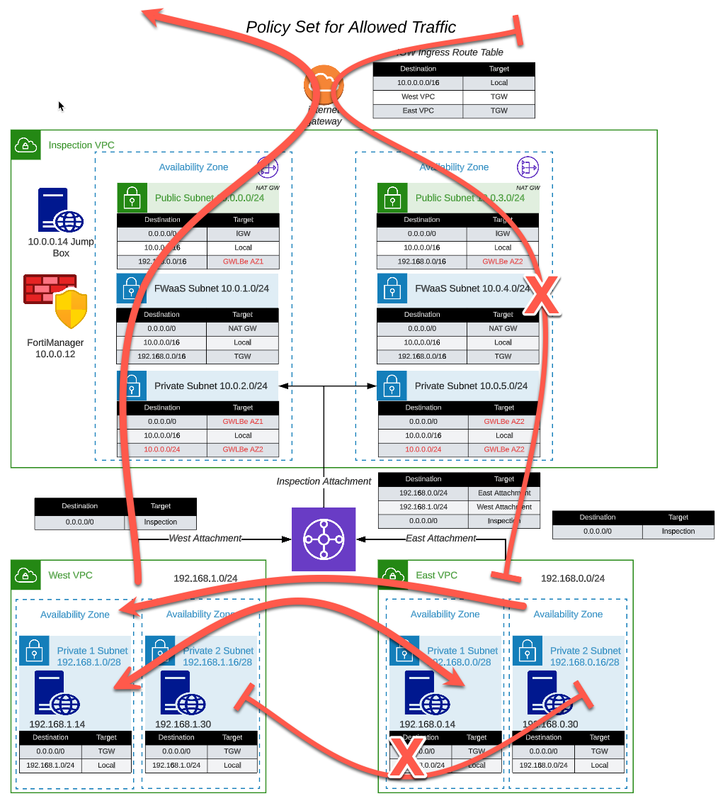
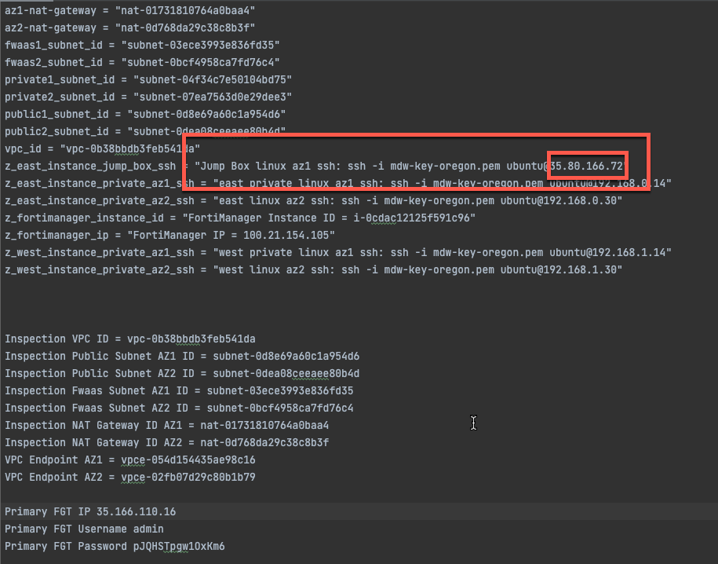
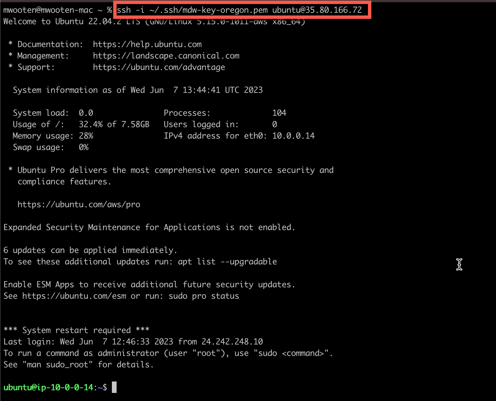
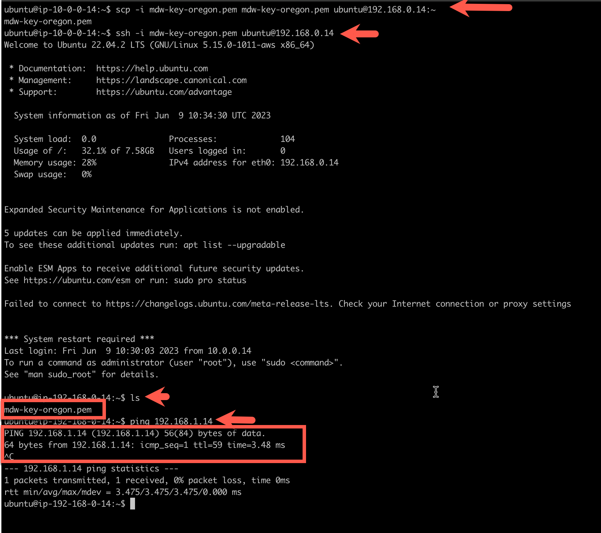
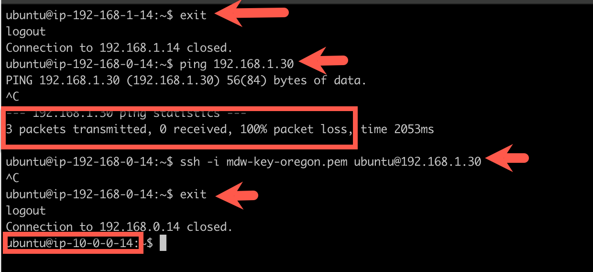
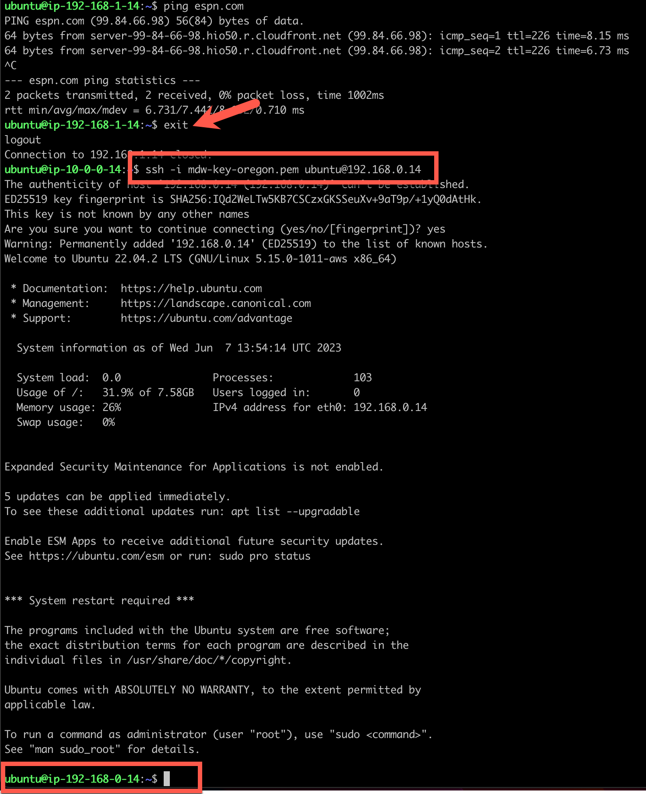
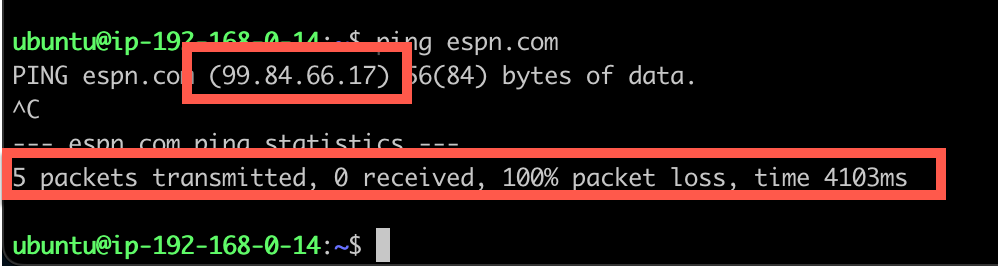
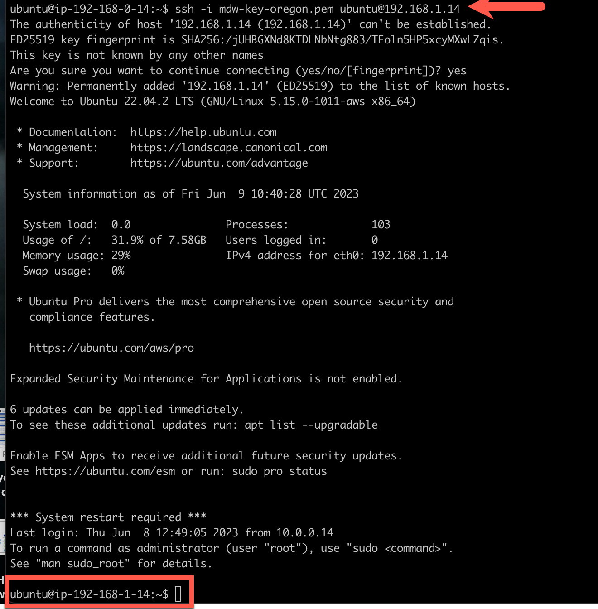

# Task 17: Test FortiGate CNF Policy Set

This lab will test our FortiGate CNF Policy Set. Refer back to our policy set diagram and test egress connectivity to the Internet from West VPC.

This section will test egress connectivity to the Internet from the West VPC.

  * Copy the Public IP of the jump box from our scratchpad.

  * ssh to the jump box
  
  > ssh -i "path to key file" ubuntu@"public ip"

  * ssh to the instance in West VPC AZ1

  > ssh -i "path to key file" ubuntu@"192.168.1.14"

  * Ping your favorite website and verify we have connectivity to the Internet

Looks good! 

"Exit" from this instance and ssh to the instance in East VPC AZ1. 

Next, we want to verify egress connectivity is BLOCKED from the East VPC.

  * ssh to the instance in East VPC AZ1

  > exit

  > ssh -i "path to key file" ubuntu@"192.168.0.14"

  * Ping your favorite website and verify connectivity is BLOCKED

DNS Name Resolution is working. This is a Native Service provided by AWS within the VPC. But as you can see, the ICMP packets are not getting out to the Internet.

Now, let's test connectivity from the East VPC AZ1 to the Westexit
VPC AZ1.

"Exit" from this instance and ssh to the instance in East VPC AZ1. 

  * scp your key file from the jump box to the east az1 instance. We will use this to ssh to the west az1 instance. The ssh will take us across the transit gateway, through the FortiGate CNF and back across the transit gateway to the West AZ
  * ssh to the instance in East VPC AZ1
  * verify that your key file was successfully transferred to the EAST VPC AZ1 instance with an "ls" command
  * verify the connectivity to the WEST VPC AZ1 instance with a ping command
  * ssh from the EAST VPC AZ1 instance to the WEST VPC AZ1 instance using the key file you transferred

  > exit

  > scp -i mdw-key-oregon.pem mdw-key-oregon.pem ubuntu@192.168.0.14:~

  > ssh -i "path to key file" ubuntu@"192.168.0.14"

  > ls

  > ssh -i "path to key file" ubuntu@192.168.1.14

"Exit" from this instance in WEST VPC AZ1 back to EAST VPC AZ1. 

Now let's try connectivity from EAST VPC AZ1 to WEST VPC AZ2. We did not create a rule to allow this, so this should be BLOCKED by the default DENY rule.

  * exit from WEST VPC AZ1
  * check connectivity to WEST VPC AZ2 with a ping (192.168.1.30). It should FAIL.
  * ssh from EAST VPC AZ1 (192.168.0.14) to WEST VPC AZ2 (192.168.1.30). It should FAIL also. 
  * exit from EAST VPC AZ1 and fall back to the jump box at 10.0.0.14

  > exit 

  > ping 192.168.1.30

  > ssh -i "path to key file" ubuntu@"192.168.1.30"

Refer to the diagram at the top of this section and test out the rest of the policy set rules. 

  * This concludes this section.