# Task 19: Cleanup

* When finished experimenting with the Policy Set, let's cleanup the CNF Endpoints, the CNF Instance, and the Workload-VPC. Start by removing all routes in the Workload VPC that point to the CNF endpoints.
* * Log into your AWS account and navigate to the [**Console Home**](https://us-west-2.console.aws.amazon.com/console/home?region=us-west-2#).
* Click on the VPC icon

* Click on "Route tables" in the left pane

* Highlight the private route table for the Inspection VPC in AZ1 (tec-cnf-lab-inspection-private-rt-az1)
* Click the "Routes" tab at the bottom
* Click "Edit routes"

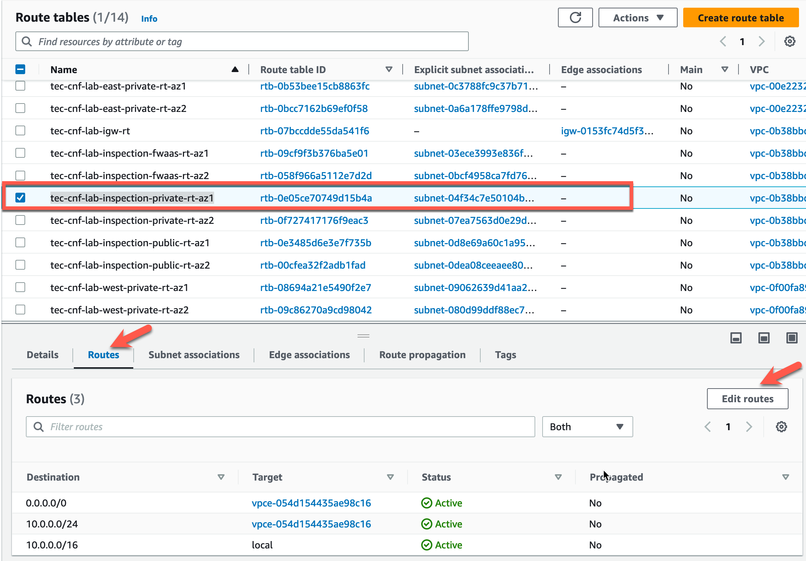

* Click **Remove** for both routes that point to the vpc endpoint
* Click "Save changes"

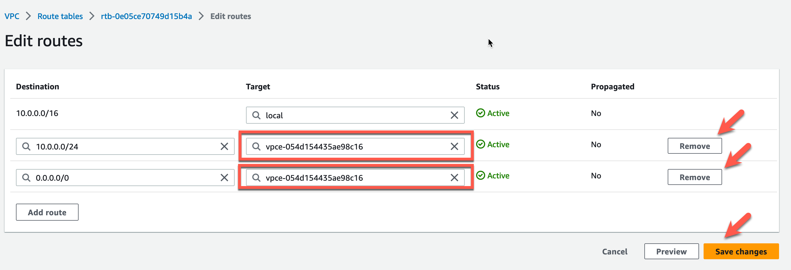

* The modified route table should like this. Click **Route tables** to continue

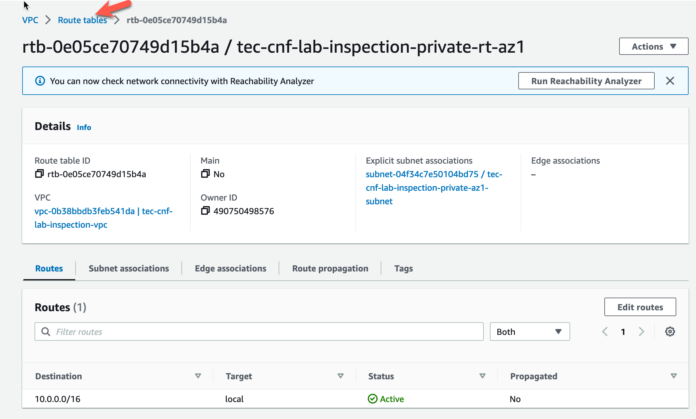

* Highlight the private route table for the Inspection VPC in AZ2 (tec-cnf-lab-inspection-private-rt-az2)
* Click the "Routes" tab at the bottom
* Click "Edit routes"

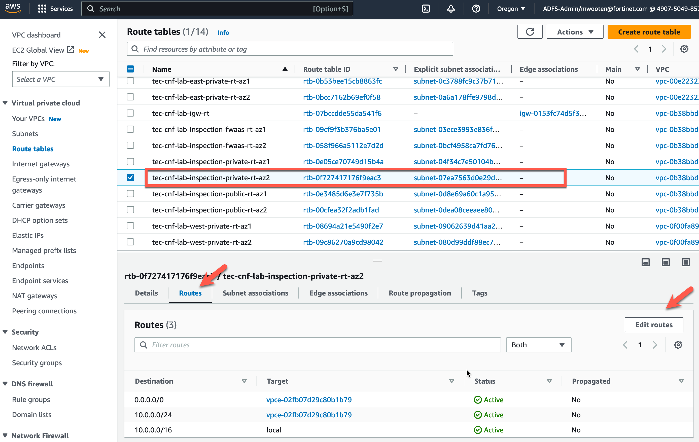

* Click **Remove** for both routes that point to the vpc endpoint
* Click "Save changes"

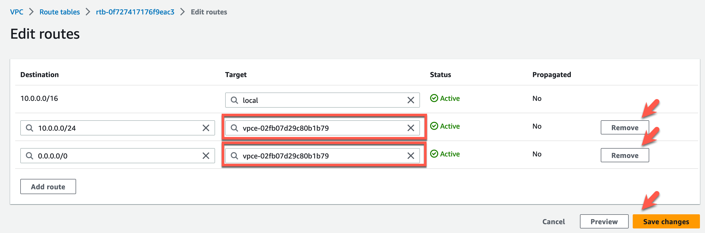

* The modified route table should like this. Click **Route tables** to continue

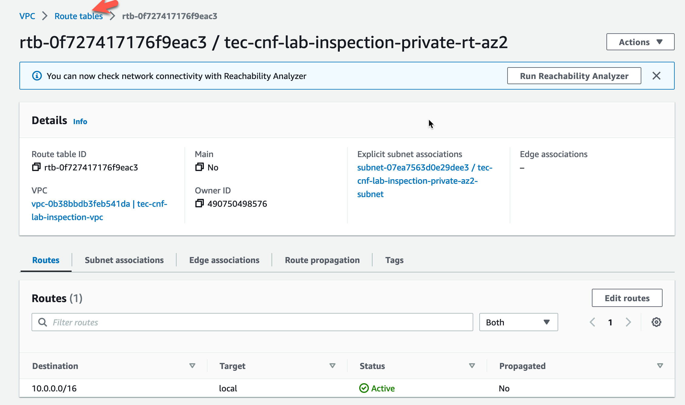

* Highlight the public route table for the Inspection VPC in AZ1 (tec-cnf-lab-inspection-public-rt-az1)
* Click the "Routes" tab at the bottom
* Click "Edit routes"

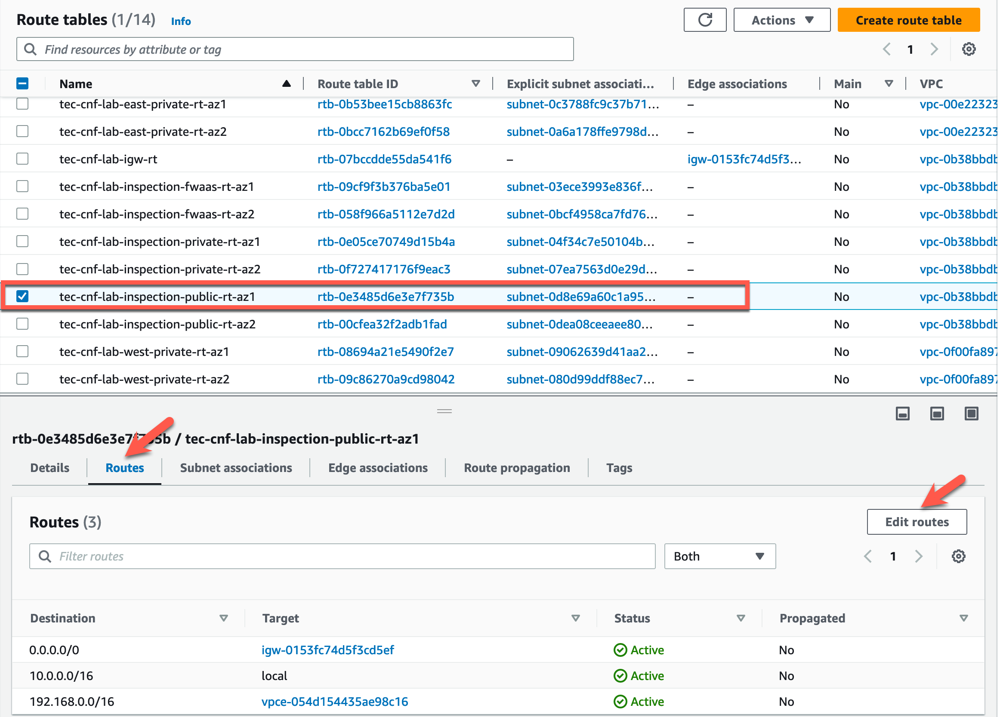

* Click **Remove** for the route that points to the vpc endpoint
* Click "Save changes"

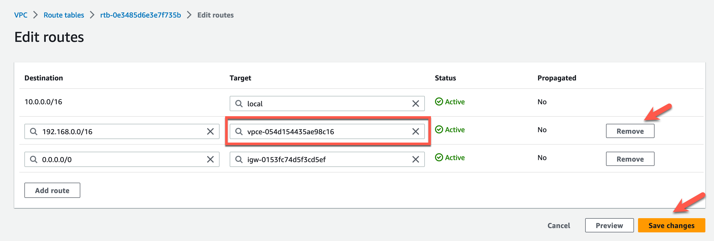

* The modified route table should like this. Click **Route tables** to continue

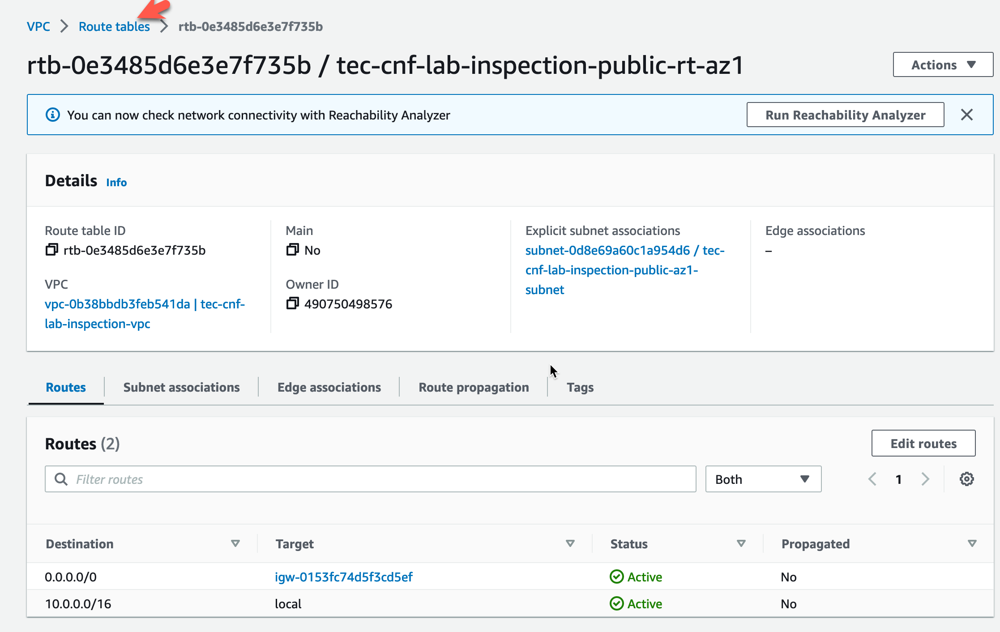

* Highlight the public route table for the Inspection VPC in AZ2 (tec-cnf-lab-inspection-public-rt-az2)
* Click the "Routes" tab at the bottom
* Click "Edit routes"

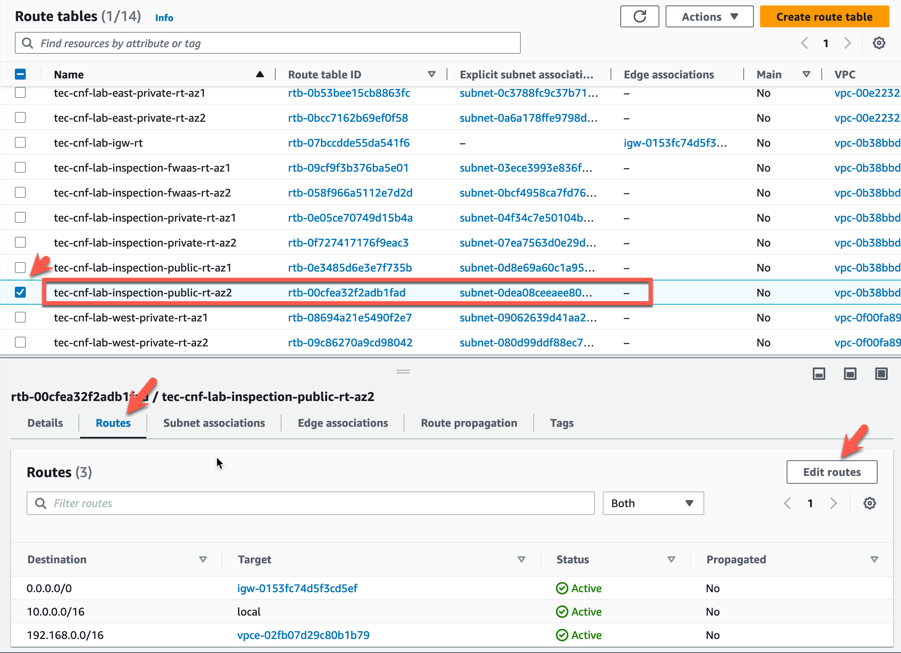

* Click **Remove** for the route that points to the vpc endpoint
* Click "Save changes"

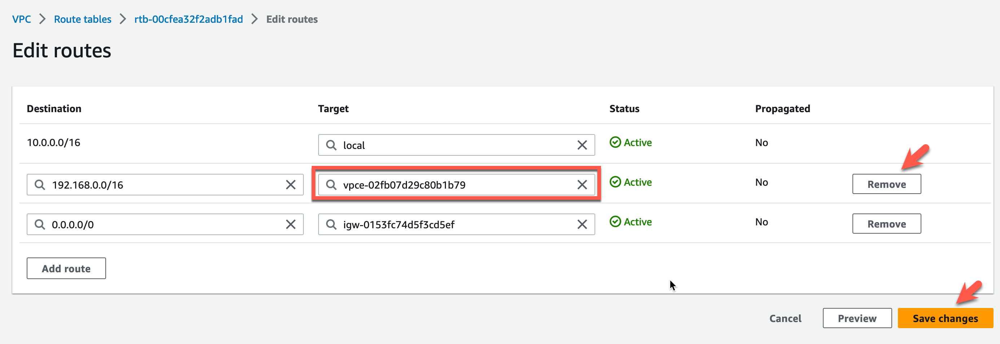

* The modified route table should like this. Click **Route tables** to continue

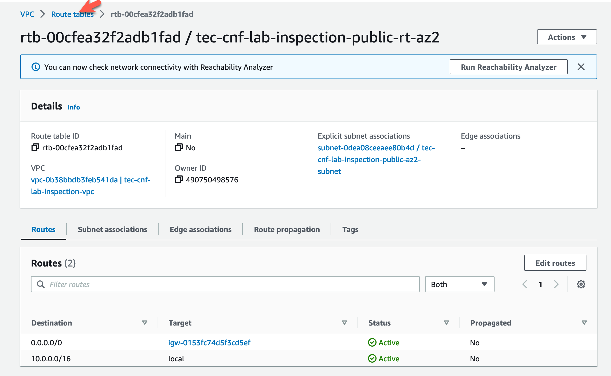

* Cleanup the Fortigate CNF endpoints and instance
* Navigate back to https://fortigatecnf.com
* Click on the proper account
* Click on CNF Instances
* Highlight CNF Instance for corp-us-west-2-cnf
* Click on **Delete**

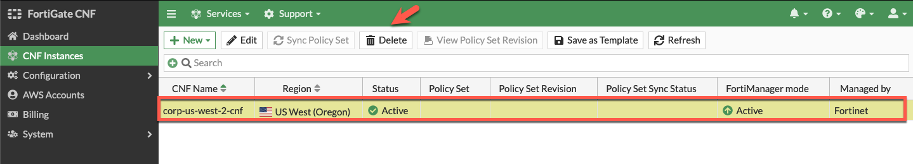

* Log into your AWS account and navigate to the [**Console Home**](https://us-west-2.console.aws.amazon.com/console/home?region=us-west-2#).
* Click on the "AWS Cloudshell" icon
* cd cnf-tec-workshop-terraform/
* cd centralized_ingress_egress_east_west/
* terraform destroy --auto-approve

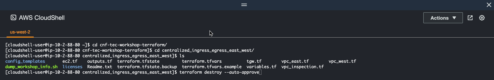

* Wait for "destroy complete"

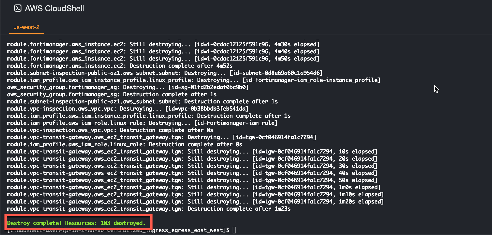

* This concludes this section.
